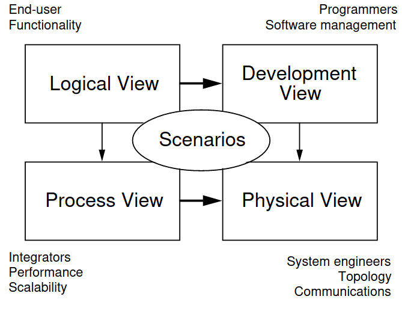
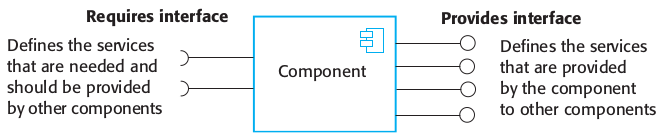

# Architectural Design

Architecture is concerned with the selection of architectural elements, their interactions, and the constraints on those elements

## Architecture in the small

Architecture in the small is concerned with the architecture of individual programs. At this level, we are concerned with the way that an individual program is decomposed into components.

## Architecture in the large

Architecture in the large is concerned with the architecture of complex enterprise systems that include other systems, programs, and program components. These enterprise systems may be distributed over different computers, which may be owned and managed by different companies.

### Functional-oriented decomposition

Decompose the program into namespaces which are functionally independent, such that one namespace is responsible for one functionality.

## 4+1 model

### Logical view

Key abstractions in the system as objects or classes. Entities should be related to system requirements.

### Process view

System composition of interacting processes (runtime). Allows assessment of non-functional ­system characteristics.

### Development view

Software decomposition for development, i.e., mapping to team structures.

### Physical view

Distribution of software components over hardware. Illustrates system deployment.

### +1 Scenarios

Scenarios/Use cases that binds the remaining four views together.

## Notations for depicting SW architecture

Depicted using simple block diagrams. Each box depicts a component. Boxes within boxes depict subcomponents.  
Arrows show the flow of data or control signals.

### What is a component?

Requires interface and provides interface that resolves to the services that are needed by other components and the services it can give to other components.

A software component can be deployed independently, and it is not required to know the source code it is composed of in order to use it.  
The services of a component are made available through interfaces and parameterized operations and thus never exposes its internal state.
