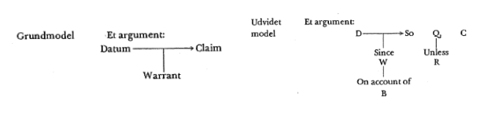
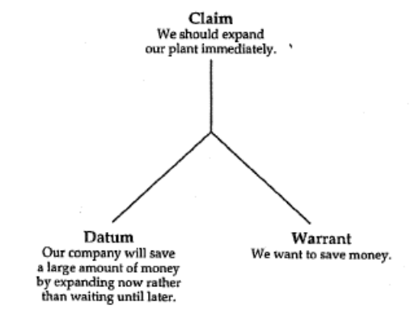

## Situationsanalyse

- Målgruppe, hvem bestemmer, hvad er vigtigt for dem?

## Lloyd F. Bitzer

### Den retoriske situation

Situationen bringer den retoriske tale til live.  
Fitting response på den retoriske situation. (Kairos).  
En situation bliver retorisk, når problemet kan afhjælpes med ord.  
Den beskrives som en sammensætning af personer, hændelser, genstande og relationer.  
Hovedpointe: Retorik er situationel.  

#### Exigence

Et påtrængende problem der skal løses. (Telos)  
Jo mere akut/påtrængende jo mere exigence.  
> Imperfection marked by urgency; it is a defect, an obstacle, something waiting to be done.

#### Constraints

Fordele og ulemper der skal inddrages

#### Fitting response

Det passende (Kairos)

#### Mediators of change

Talen skal skabe en beslutning eller handling der afhjælper exigencen.  
En delmængde af publikum der er i stand til at træffe beslutning/handling.

## Richard E. Vatz

Man skal kombinere Bitzers analyser med kreativ og skabende tænkning.
Der er flere veje der fører i mål.

## Øivind Andersen

### Kairos

Få sagt det passende. Situationelle overvejelser: Omfang, form og timing.  
Rummer timing & ordvalg. Man skal kende sin modtager.  
Modsat til akairos eller evkairos.

### Doxa

Det sunde skøn. Handler om at handle ud fra hvad vi allerede ved (Erfaring, værdier, sandsynlighed og livskundskab).

Både faktuelt og subjektivt. Modtager har sin doxa der skal tages højde for (og flere modtager kan have forskellige doxaer).

### Peitho

Overtalelse. Hvad vil vi gerne opnå? Navnet på den græske gudinde for overbevisning. Tæt relateret til engelsk ”persuasion”

### Telos

Mål eller formål. Ofte forskellige fra afsender til modtager. Fokuser på modtagers telos.  
Hvad vil kunden gerne have ud af det?

## Charlotte Jørgensen

### Syllogisme

Matematisk måde at føre logik på. Logik kan i syllogismen sættes på en formel.  
For eksempel:  
Alle hunde er dyr.  
Alle dyr har fire ben.  
Derfor har alle hunde fire ben.  

Læner sig meget op af predicate logic i Diskret Matematik.  
Udgøres af en major (oversætning), minor (undersætning) og en konklusion som svarer til  
følgende tre faste elementer af Toulmins argumentationsmodel:  
Major -> Warrant  
Minor -> Datum  
Konklusion -> Claim  

Dog er syllogismen anderledes fra Toulmins argumentationsmodel da syllogismen samler major og minor under betegnelsen ”præmisser”.  

Bruger primært ”Alle A er B” eller ”Ingen A er B” (Alle mennesker er dødelige, ingen dyr har tolv ben).

### Stephen Toulmin's Argumentationsmodel

Et argument kan brydes ned i mindre dele på sætningsplan, altså mikrostrukturen i en tekst.  
Delene kan komme i vilkårlig rækkefølge, et argument kan altså både starte eller slutte med sin påstand:  
”En hund har fire ben fordi den er et dyr”.  
”Fordi en hund er et dyr må den altså have fire ben”.  
Claim, datum og warrant er faste elementer og udgør grundmodellen.  
Derudover findes yderligere tre fakultative elementer (qualifier, rebuttal og backing) som indgår i det udvidede model.

#### Claim (Påstand)

Den del der påstås og som underbygges af de øvrige elementer.  
I en større tekstsammenhæng kan dette claim bruges som et datum blandt, muligvis blandt flere data, til at opnå et større og mere generelt claim (hovedpåstanden(e)).

#### Datum (Belæg)

Singulær for data. Rummer informationen eller grundlaget, som claim baseres på. Oftest eksplicit (kan aldrig undlades, ellers er det ikke et argument men bare en påstand).

#### Warrant (Hjemmel)

Autoriserer overledningen / forbinder claim og datum. Oftest implicit (kan ofte undlades).  
De fleste warrants er åbne for undtagelser.

#### Qualifier (Styrkemarkør)

Knytter sig til claim/påstand og er oftest adverbier (nødvendigvis, sandsynligvis). Afspejler styrken (force) af hjemlen i argumentet.

#### Rebuttal (Gendrivelse)

Sikrer sig mod et modargument.  
Knytter sig til qualifier, da den gør forbehold eller usikkerheder konkret.  
Da de fleste warrants er åbne for undtagelser, kan Toulmins model med rebuttals altså kan bruge argumenter som ”De fleste mennesker er dødelige”, ”Stort set ingen dyr har tolv ben”.

#### Backing (Rygdækning)

Yderligere dokumentation når warrant/hjemlen er usikker.  
Man kan kalde den hjemlens hjemmel. Warrant uddrager en generel regel ud fra backing.  
Enten er backing statistik/data/forskning, eller også er det eksempler.  

#### Enthymem

Enthymemet adskiller sig fra syllogismen da præmisser er sandsynlige (oftest, sædvanligvis).  
Der underforstås en præmis (ofte majoren i syllogismen). Dermed er enthymemet en deduktiv sandsynlighedsslutning, modsat syllogismen der danner en sand konklusion på sande præmisser.

#### Paradigme

Et paradigme adskiller sig fra et enthymem ved at være induktivt frem for deduktivt.  
Bygger på et eller få fortilfælde.  
Eksempel:  
> Hitler var en ond mand fordi han diskriminerede et folkefærd (datum).
>
> Trump er derfor en ond mand fordi han diskriminerer et folkefærd (claim).

## Charlotte Jørgensen & Merete Onsberg

### Korrekt argumentation

Modsat videnskabelig logik, hvor præmisser skal være sande førend påstanden kan være sand, så baserer korrekt argumentation sig på kvalificerede meninger. Belæg og hjemmel kan således være mere eller mindre rigtig eller forkert, god eller dårlig, hensigtsmæssig eller uhensigtsmæssig. Jørgensen & Onsberg nævner særligt to argumentationsfejltyper som interessante.

#### Ad hominem

Ad hominem argumentet er en etosappel, hvor man pålægger personen selv en betydning, der er irrelevant ift. påstanden. Et eksempel kunne være at beskrive en politiker som magtmenneske, fordi politikeren i sit private hjem ikke påtager sig den kulturelle normrolle.

Et eksempel, som ikke er et ad hominem argument kunne være, at en ryger forsøger at argumentere over for sit barn, at det ikke skal ryge. Her har forælderens personlige forhold ift. rygning relevans for vedkommendes argument. Dog er relevansen for et personligt forhold afhængig af kultur. Således kan et forhold have forskellig betydning afhængigt af hvilken kultur dette argument fremføres.

#### Cirkelbevis

Et cirkelbevis er et argument, hvor belæg og påstand gentager hinanden. Et eksempel er at påstå, at en bog er god fordi man selv synes den er god. Medmindre afsender har en etosappel der gør argumentet til et autoritetsargument er det altså en fejltype.

### Effektiv argumentation

Kvantificerer man virkningen af argumentationen, altså argumentets tilslutning, får man argumentets effektivitet. Selvom et argument forsøger at være effektivt, gør det ikke nødvendigvis argumentet godt. Det kan f.eks. skyldes, at argumentet er misvisende eller direkte forkert. Selvom man kan overbevise et antal seere af en nyhedskanal gør det ikke argumentet godt, hvis det er baseret på forkert journalistik.

### Interessant argumentation

Et kedeligt sprog eller en kedelig fremførsel af et argument kan helt miste effekten af argumentet, hvis man lader argumentet tale for sig selv, selvom argumentet ellers er godt.

Interesse kan skabes på baggrund af indhold der er nyt, kontroversielt eller overraskende for modtageren, fx hvis man inddrager information som modtageren kender men ikke havde forventet i denne sammenhæng.

Særligt kontroversiel argumentation, der enten skaber en følelse af, at der endelig er nogen der siger det modtager mener, eller som er imod modtagerens egen holdning af et emne, kan skabe interesse. Dog kan en stærk kontroversiel holdning gøre, at modtager frastødes afsenderen og helt mister interessen, så der er altså en hårfin balance.

Interessant argumentation inkluderer også fortællestilen, herunder den nonverbale:  
Kropsholdning, slag i et bord o.li.

#### Platheder

Et eksempel på dårlig, uinteressant argumentation er dog en plathed der kendetegnes ved at være trivielt. Det giver altså ikke mening at sige det modsatte af argumentet:

”Vi vil føre ansvarlig politik” er altså en plathed, fordi ”Vi vil føre uansvarlig politik” ikke giver mening, medmindre konteksten som afsender og modtager indgår i giver dette argument en særlig betydning. Det er dog også kun en plathed såfremt det trivielle fremgår af belæggets plads eller som en påstand uden belæg.

### Redelig argumentation

Redelighed vedrører afsenders holdning til modtager. Afsender argumenterer uredeligt, når man forsøger at udnytte modtager ved at bringe denne i vildfarelse. Det kan skyldes, at modtager er ude af stand til at gennemskue argumentationen. Uredelig argumentation kan bestå i, at afsender (bevidst) forsøger at vinde tilslutning ved hjælp af løgn, fortielse eller fordrejning. Fordrejningen findes i tre forskellige udgaver: overdrivelse, forenkling og udskiftning.

#### Symmetrisk vs asymmetrisk kommunikationsforhold

Symmetrien mellem afsender og modtager afhænger af magtforholdet mellem de to.  
Såfremt de i situationens kontekst har lige stor magt bærer både afsender og modtager et ansvar for argumentationens redelighed. Asymmetrisk argumentation bliver farligt, når afsender spekulerer i det asymmetriske kommunikationsforhold.

#### Overdrivelse

En fordrejning, hvor man gennem ordvalg lader modtager forstå en situation som værre,
end den er.

#### Forenkling

En fordrejning, hvor man omdanner en kompliceret sag til et spørgsmål om enten/eller, ja/nej.

#### Udskiftning

En fordrejning, hvor man lader to forskellige sager få samme betydning eller betydning for hinanden, fx hvis man lader et valg om donation til Dansk Flygtningehjælp til at være et spørgsmål om dansk udenrigspolitik.

#### Syndebukargumentation

En anden form for uredelig fordrejning er et syndebukargument. Her lader man nogle stå til mål for noget, de ikke har gjort. Denne form for uredelig argument bærer præg af både udskiftning og forenkling, og har særligt propagandistiske træk. Derfor er den ikke særligt velegnet i vestlige demokratier og vil ofte frastøde folk.

### Eristik

Et eksempel på dårlig argumentation er eristisk argumentation. Denne er kendetegnet ved, at afsender er fastlåst på holdning og vil jorde sin modtager uanset pris. Her er afsender uimodtagelig overfor modargumenter og er særligt uredelig i situationer, hvor modtageren forsøger at finde fælles forståelse eller beslutningsgrundlag.

## James C. McCroskey

### Invention

Når man har udført grundig research om et emne er man nået til den del, Invention, hvor man undersøger mulighederne for, at overtale (persuasio) modtagerne. Her undersøger man hvilke metoder der er bedst til netop dette, som jo blandt andet afhænger af, om modtagerne allerede er enige i synspunktet eller har en anden holdning.

Man er også nødt til at finde ud af, hvilke argumenter man har til rådighed – Hvilke argumenter kan vi argumentere for, og med hvilket belæg? Er en ethos-appel nok, hvis afsender har en vis autoritet/respekt hos modtageren, eller kræver det appel til den logiske fornuft (logos)? Her vil man kunne opstille følgende model der viser Toulmins simple
argumentationsmodel på en anden måde:

I eksemplet ovenfor er hovedargumentet opstillet i en arbitrær tale. Her må afsender overveje, om datum er tilstrækkeligt hos modtagerne, fordi de allerede må forventes at forstå eller være enige i dette belæg – eller om belægget vil kræve sit eget argument hvor denne påstand fremføres med anden belæg og hjemmel. Derudover skal hjemmelen også være gensidig hos afsender og modtager (Modtager skal også synes, at finansafdelingen har styr på deres finanser, eller som i ovenstående tilfælde at det er vigtigt at spare penge frem for mulige andre interesser).

#### Backup Arguments

En meget god idé kan være at forberede supplerende argumenter som kan bruges undervejs i en tale, såfremt at modtager ikke virker overbevist af de forberedte argumenter. Det kan være man har lavet et argument der baserer sig på egen ethos, men hvis modtager ikke har den opfattelse af dig som du havde regnet med, kan argumentet have en mindre effekt. Her ville det være godt med et argument der baserer sig på logos eller pathos i stedet afhængig af afsender og situationen.

Vi kan dog have et kvalificeret bud på, hvordan publikum opfatter eller modtager et delargument. Det får vi gennem McCroskey’s Audience Analysis. Dog er publikum ikke statisk, da shareholders i en virksomhed kan skifte, alder medfører nye vælger i politik samt det faktum, at argumenter undervejs i talen jo forsøger at ændre modtagernes opfattelse.

Derfor er det vigtigt ikke at tro, at ens audience analysis er tilstrækkelig til at danne de rigtige argumenter, men at man i stedet skal sikre sig at have backup argumenter klar.

#### Topoi

Aristoteles definerer 15 emner, som kan bruges som argument for, at overtale.

Disse inkluderer velstand, sundhed, liv, visdom, magt, omdømme, retfærdighed og mod m.fl. Modsat kan man også argumentere mod det modsatte (fattigdom, usund, død, manglende viden etc.)

Man kan sjældent lave argumenter der passer til samtlige af de 15 topoi (emner), samt de domænespecifikke der findes afhængigt af det givne emne / kontekst (videnskab, politik osv.)

Den mest udbredte form for retorisk kommunikation omhandler politik (ikke nødvendigvis national politik). Her er de gængse/mest normale topoi som følgende:

- Behov (Er der et problem eller behov der skal løses)
- Inherency (Er der noget galt med det nuværende system/løsning)
- Politik (Løser dette forslag den opfattede problemstilling hos modtagerne)
- Praktisk (Er denne løsning mulig i virkeligheden eller kun i teorien)
- Fordele (Opvejer fordelene løsningens ulemper)
- Modplan (Er det den bedst mulige plan eller findes der bedre forslag)

#### Data & evidence

Det er vigtigt, at man har data (datum) der understøtter sine claims.  
Typen af data afhænger af, om vores tale er koncept-centreret eller ethos-centreret. Særligt ved ethos-centrerede taler bør man overveje hvilke kilder man bruger. Disse inddeles ofte i følgende tre kategorier efter effektivitet:

1. Unbiased (Professorer o.li. der ikke påvirkes af emnet)
1. Reluctant (Folk der siger det modsatte af, hvad deres forventede interesse tilskriver)
1. Biased (Folk der siger det, der kan forventes ud fra deres interesse)

Derudover er det vigtigt, at kilden er kompetent (ved noget om emnet), relevant (fortæller direkte noget i forbindelse med argumentet), tilstrækkeligt (er der nok data for at forklare påstanden), konsistent (svarer til anden kendt viden/evidens) og ny (kommer fra en nylig kilde).

### Disposition

Der findes mange modeller for dispositionen af en tale. For at skabe en disposition, altså
overordnet struktur af talen, navngiver Cicero 3 opgaver:

- Udvælge argumenter (Hvilke argumenter overtaler bedst modtageren?)
- Lægge vægt på særlige argumenter (Hvor meget tid skal hvert argument have?)
- Arrangere argumenterne i den bedste rækkefølge

#### Arrangering

Der findes forskellige standarder eller teorier om rækkefølgen af en tekst. Platon omtaler de tre dele:

- Indledning
- Hoveddel
- Konklusion

Aristoteles skrev, at det kun er ”påstanden og beviset” der ikke kan undlades men anerkender, at en indledning og konklusion ofte er passende.

En anden kendt teori inddeler en tekst i 6 dele: (Cicero)

- Exordium (Indledning)
- Narratio (Præsentation af fakta)
- Divisio (Opsummering af tekstens kommende hovedpunkter)
- Confirmatio (Konstruktive argumenter)
- Confutatio (Gendrivelse, rebuttal)
- Conclusio (Konklusion, hvad skal modtager huske, føle og gøre bagefter)

Denne kaldes ad Herennium, den antikke eller den klassiske model.

#### Alan Monroe’s Motivated Sequence

Særlig brugbar for tekster, der skal overbevise, men passer også til informative tekster.

Monroe’s Motivated Sequence omfatter 5 dele:

- Attention (Indledning, fanger opmærksomhed)
- Need (Problemet/behovet der omtales)
- Satisfaction (Forslag til løsning)
- Visualization
  - Positiv: Hvordan vil verden se ud med løsningsforslaget implementeret
  - Negativ: Hvordan vil verden se ud uden løsningsforslaget
  - Kontrast: Positiv og negativ holdt op imod hinanden
- Action (Konklusion)

#### Struktur

- Chain structure:
  Argumenter følger hinanden da disse forklarer den næste. Et argument indeholder altså et claim der bruges som datum eller warrant i næste argument.
- Parallel structure:
  Argumenterne følger ikke hinanden da et argument ikke bruges i den næste. Argumenterne taler altså alle om samme claim men bruger forskellige datum / warrant.

Der findes desuden 12 forskellige ”mønstre” (patterns) nævnt af James McCroskey, der omfatter alt fra problemløsning, reflektiv tænkning, sammenligning versus kontrast og klimatisk versus antiklimatisk struktur.

### Etos

Etosappel har i mange år været anset som særligt stærk. Etosappel omhandler den troværdighed og prestige som modtageren opfatter og altså dennes attitude som modtageren har mod kommunikationen. Etosappel opdeles i initial etos, afledt etos og terminal etos. Det er vigtigt at understrege, at etos findes hos modtageren og kan derfor være forskellig fra person til person selvom de indgår i samme situation.

#### Dimensioner af attitude

Når man snakker om Etos snakker man om multidimensionel attitude. Aristoteles identificerede tre dimensioner: Intelligens, karakter og goodwill. Tre nyere socialpsykologer har identificeret ekspertise(competence/pronesis), troværdighed(character/arete) og intention mod modtageren(possible caring/eunoia) som dimensioner af Etos-attitude (Carl I. Hovland, Irving L. Janus, Harold H. Kelley). De tre dimensioner lægger sig meget op af Aristoteles’ tilsvarende. Empiriske researchers Berlo og Lemert har med hjælp fra computere identificeret en forskellig dimension fra de forrige eksemplers ”intention” / ”goodwill”. De er i stedet kommet frem til dynamik. McCroskey er ved undersøgelser kommet frem til, at intention kan være en del af eller overlappe med karakter og derfor ikke nødvendigvis er en selvstændig dimension fra de øvrige.

#### Initial Ethos

Mange forskellige forsøg har vist, at præsentationen af en taler har indflydelse på modtagernes opfattelse af kommunikationen. F.eks. har en overlæge større indflydelse end en politisk leder eller universitetsstuderende, når emnet omhandler fx national obligatorisk sundhedsforsikring. Det gælder også, selvom talen er fuldstændig identisk, fx optaget på forhånd men præsenteret som kommende fra de tre forskellige afsendere.

Dog kan emnet også afgøre, hvilken betydning forskellige etos-relaterede appeller har. Fx kan en politiker fra et kommunistisk parti miste etos, hvis budskabet fra afsenderen handler om national styring af uddannelse, mens det ikke havde relevans ved et budskab om ønsket dødsstraf.

Initial etos kan også påvirkes af omstændigheder, der ikke omhandler afsenderen direkte.  
F.eks. kan en optaget præsentation af en taler give stor initial etosappel, når modtagerne er en gruppe studerende og deres kursusleder er til stede, modsat en gruppe studerende hvor deres kursusleder ikke er til stede.

Initial etos påvirker både meningsdannelse men også indlæring, både i form af, at vi er mere tilbøjelige til at søge information fra personer, vi finder kloge, men også fordi vi er bedre til at lytte, når sådanne personer lærer fra sig.

#### Derived Ethos (afledt)

Afledt etos er den attitude, som modtageren skaber undervejs i kommunikationssituationen. Det kan dannes på baggrund af afsenderens brug af belæg eller hvis afsenderen tager stilling til forskellige spørgsmål. Modtagernes kendskab til belægget har dog også betydning for gennemslagskraften, hvor det altså ikke nytter det store at nævne viden, som modtageren allerede kender til. Dårlig belæg kan dog også have negativ indflydelse. En modtagers opfattelse af afsenders oprigtighed har også indflydelse, selvom afsenderens egentlige oprigtighed ikke har indflydelse.

En afsender kan øge sin afledte etos ved taktisk at nævne dele af vedkommendes baggrund, særligt hvis modtagerne ikke kender afsenderen (betydeligt) på forhånd.

#### Terminal Ethos

Modtageres opfattelse af afsenderen efter en kommunikationssituation er sjældent irrelevant. Oftest vil afsenderen adressere modtagerne igen på et senere tidspunkt, og den terminal etos er derfor relevant for afsenderen, da denne vil fungere som den initiale etos før den næste kommunikationssituation.

Noget kommunikation er faktisk endda etos-centreret kommunikation, hvor målet med kommunikationen er at fremme afsenderens etos hos modtagerne. Det gælder særligt ved valgkampagner som f.eks. debatter og lignende. Det gælder også for meget kommunikation fra virksomheder, som forsøger at skabe eller vedligeholde en god etos hos den offentlige befolkning.

Afviser man betydningen af terminal etos kan gøre, at man fremstår som en ”dårlig taber”.  
Hvis en politiker ikke allerede ved tabet af et valg tænker på sin fremtidige karriere, men i stedet bruger chancen til at beskylde medier eller lignende for årsagen til valgkampens resultat kan drastisk forværre eller helt ødelægge chancerne for en fremtidig valgkamp. Det gør sig blandt andet gældende for Richard Nixon tilbage i Californien 1962 (6 år før han blev præsident).

### 5 typer magt

#### Tvang / Coercive

Baseret på modtagers opfattelse af , om vedkommende kan blive straffet af afsenderen, hvis man ikke lader afsender have den ønskede indflydelse. Styrken af tvangsmagt afhænger af modtagers opfattelse af sandsynligheden for straffen samt ønsket om at undgå straffen.

Negativt for ethos.

#### Legitim / Legitimate

”Tildelt magt”. Det er magt som en person har qua sin rolle, f.eks. borgmester, statsminister eller elevrådsformand. Den legitime magts kraft afhænger af modtagerens opfattelse af afsenderens rettigheder.

Negativt for ethos.

#### Belønning / Reward

Tæt på det modsatte af tvangsmagt. Baseret på modtagerens opfattelse af en evt. belønning ved at efterkomme afsenderens ønske om indflydelse. Styrken afhænger altså af modtagers opfattelse af sandsynligheden for belønningen samt ønsket om at få belønningen.

Neutralt for ethos.

#### Ekspert / Expert

Ekspert magt refererer til modtagers opfattelse af afsenderens viden eller kompetence om emnet.

Positivt for ethos.

#### Referencekraft / Reference

Referencekraft afhænger af modtagers opfattelse af afsenderen i forhold til deres interpersonelle relation.

Positivt for ethos.

## Georg Søndergaard

### Klassisk retorik

Den klassiske retorik fokuserede på det talte ord, selvom den erkendte vigtigheden af det skrevne ord. Dette skyldtes primært den tekniske udvikling. I klassisk retorik inddeler man taler i tre genera (hovedkategorier). I den moderne, vestlige verden er der dog behov for en mere specificeret inddeling (f.eks. den religiøse prædiken, det faglige foredrag).

I klassisk retorik fra den græske bystat Hellas anses Demosthenes som den politiske tales grundlægger Platon som retorikkens første store kritiker og Aristoteles som retorikkens ledende grundlægger. I Romerriget fortsætter traditionen med historiens måske verdens største tale Cicero samt Quintilian og Augustin.

#### Genus Iudicale (juridisk tale)

Tager udgangspunkt i fortiden og fokuserer på ret og uret. Rammen er retssagen hvor anklager og forsvarer hver især forsøger at overbevise dommere og domsmænd.

#### Genus deliberativum (politisk tale)

Drejer sig om fremtiden og talerens ønsker, som publikum forsøges at overbevises om.

#### Genus demonstrativum (påvisende tale)

Lejlighedstaler der drejer sig om nutiden, kan også betegnes som en formidlende tale.

### Persuasio / Peitho

Et hovedbegreb for en sproglig meddelelse er persuasio, netop dens evne til at overtale eller overbevise modtageren. Det kan ifølge Aristoteles gøres på tre måder:

#### Ethos

Se tidligere afsnit, uddybende om logos (overtales gennem de personlige egenskaber hos
afsenderen).

#### Logos

En appel til den logiske fornuft.

#### Pathos

En appel gennem følelser og talens emotive vægt.

### De fem forarbejdningsfaser

Bør ikke følges alt for rigoristisk men derimod hoppe imellem faserne.

#### Inventio

Indsamling af materiale. Situationsanalyse.

Her er argumentationen vigtig og der bruges gerne Toulmins argumentationsmodel.

Derudover bør man overveje forskellige eksempler der kan

1. Dokumentere
  Forbedre sit argument ved at fortælle, hvor diverse citater, holdninger m.m. kommer fra. Særligt hvis modtager har en vis Ethos til afsenderen af dette eksempel.
1. Illustrere
  Frem for at redegøre med ord alene, kan et livligt eksempel belyse et eksempel på en bedre måde.
1. Perspektivere
  Danne nogle tanker hos modtageren der sætter et eksempel i enten et bredere eller mere præcist perspektiv.

#### Dispositio

> Læren om den hensigtsbestemte udvælgelse og anordning af det stof, som inventio’en har
skaffet til veje
> *Fafner*

Altså, at man organiserer det tankemæssige indhold fra inventio-fasen.  
Organiseringen består af følgende hovedelementer:

- Exordium (Indledning)
- Corpus (Hovedafsnit)
- Peroratio (Afslutning)

Corpus kan inddeles yderligere, f.eks. i argumentation, narratio (sagsfremlæggelse), probatio (bevis) og refutatio (modbevis).

#### Elocutio

Tredje fase i forarbejdningen består af de fire virtutes elocutionis:

##### Aptum (Relevans)

Omhandler det at bruge den sproglige udformning, der giver mening i kontekst af modtageren/modtagerne. Det skyldes, at ingen bestemt talestil passer til enhver sag, tilhører, taler eller lejlighed.

##### Puritas (Sprogrigtighed)

Sproget skal være rigtigt førend det er godt. Det er vigtigt at undgå fejl i udtale, stavning, sætningsopbygningen mv., da dette forringer den opfattede kvalitet hos modtageren.

Puritas kan dog ikke sættes på formel, da der findes mere og mindre systematiske regler og mere eller mindre præcise regler. Der er mange danskere der kan blive enige om rigtig udtale, men det er umuligt at fastlægge det præcise regelsystem for netop den korrekte udtale.

##### Perspicuitas (Klarhed)

Tekster, med mange fremmedord eller rækker af komplicerede ord, komplicerede syntakser eller sprogligt fyld kan være en tekst svær at læse (eller høre). Eksempler kan være ”personlighedsegenskaber”, ”forbrugsbegrænsende indgreb” eller lange sætninger, der alle kræver ekstra tid og fokus for at forstå – tid, der ikke er i en tale, og flytter fokus væk fra en teksts hovedpunkter.

##### Omatus (Stilistisk kvalitet)

Den klassiske retorik skelner mellem tre stilniveauer:

- Genus sublime (høj stil)
- Genus mediale (neutral stil)
- Genus subtile (lav stil)

Det omfatter altså både den sproglige ”udsmykning”, metaforer, gentagelser, sammenligninger og andre stilistiske virkemidler.

Hvad der er særligt for netop omatus er de to hovedkategorier troper og figurer:

###### Troper

Denne kategori dækker over ord og vendinger, der bruges i en overført betydning og altså ikke den egentlige betydning, som disse ord eller vendinger normalt har.

Det kan være sammenligninger, metaforer mv.

###### Figurer

Stor og uensartet kategori der dækker over retorik og stilistik og dermed blandt andet noget rent lydligt eller arrangeringen af ord der på tekst danner et særligt udtryk.

Kan opstilles i de fire hovedkategorier af figurer:

- Gentagelsesfigurer
- Modsætningsfigurer
- Dramatiske figurer
- Symbolfigurer

#### Memoria

Fjerde forarbejdningsfase omhandler det at huske sin tale. Hvor dette særligt har været vigtigt i antikken, hvor det var et fåtal der kunne skrive og læse, har manuskriptet i dag erstattet en stor del af behovet for at huske sin tale. Dog kan oplæsning af en tale virke amatøragtigt og altså være et tegn på manglende persuasio.

#### Actio

Femte og sidste forarbejdningsfase omhandler fremførelsen af sin tale.

Når en skreven tekst læses højt og fremføres som en tale kommer det i udtryk som en fortolkning af teksten. Det kan beskrives med Fafners 5 mundtlighedskriterier:

##### Artikulation og frasering

Det er vigtigt for en tale at have en klar og tydelig udtalte. Derudover at selve fraseringen, altså sætningselementerne, får en særlig sammenhæng imellem sig.

##### Tempo og pausering

Hastigheden, som en tekst fremføres med, der skal passe til tekstens kompleksitet og modtagerne. En kompleks tekst bør altså foregå langsommere end en simpel tekst, og en tekst for folk med en forforståelse af et emne kan foregå hurtigere end den samme tekst for modtagere uden kendskab til emnet.

Bevidst brug af pauser kan isolere og dermed sætte fokus på bestemte ord eller sætningsdele.

##### Styrke

I forbindelse med en tales fremførelse omhandler styrken de forskellige tryk man kan bruge på de enkelte ord eller stavelser for at fremhæve særlige dele af en tekst.

##### Melodik

Dynamikken i fremførelsen af teksten, både på det specifikke niveau men også set i et større perspektiv i gennem hele teksten.

##### Klang

Et meget bredt begreb men som f.eks. kan skabe visse følelser i fremførelsen af tekst.

## Charlotte Jørgensen, Christian Kock & Lone Rørbech

### Eksemplets magt

Perelman opstiller tre grundformer af eksempelfunktioner:

1. Eksemplet
  Enkelttilfældet bruges som dokumentation for en generalisering.
1. Illustration
  Et enkelttilfælde bruges for at gøre en allerede kendt regel mere nærværende. God til at vække opmærksomhed eller skabe interesse ved et emne som modtagerne ikke i forvejen har interesse for.
1. Model
  Enkelttilfældet bruges som opfordring til at blive efterlignet.

Mange eksempler følger helt eller primært en af formerne, men kan sagtens blande to eller alle tre af formerne.

### Stemme og krop

Ved fremførslen af en tale er det langt fra ordet der afgør, hvad publikum hører og forstår.

F.eks. kan tonelejet gøre et ja til et nej og omvendt. Det er blandt andet det udbredte ironi der findes i Skandinavien der kan sørge for dette, men det kan også handle om at sige en ting men mene noget andet – som kan gennemskues fordi ens toneleje eller kropssprog siger noget andet.

#### Stemmebrug

Selvom tonefaldet (om man har et varmt og blødt tonefald eller et koldt og uvenligt tonefald) ikke ser ud til at have nogen påvirkning, så har stemmeføringen/fraseringen det.

Det handler om måden hvorpå man binder ord sammen til en større mening. Dette viser statistik har en stor betydning.

Lidt mindre betydning har artikulationen ift. om man er energisk og tydelig eller træt og slap.

#### Mimik

Ligesom ved tonefald har venlig kontra uvenlig mimik ikke nogen indflydelse på overtalelsen.

Dog har det, at holde øjenkontakt, en stor effekt på persuasio. Det vil sige, når man er i stand til at holde modtageren fast med sit blik.

#### Kropsholdning

Statistisk er en åben kropsholdning lidt bedre end den lukkede, men ikke nok til at være statistisk signifikant.

Dog er kombinationen af en lukket kropsholdning og uvenlig mimik en stor negativ indflydelse på persuasio. Dette kaldes afvisende attitude.

Det tredje træk inden for kropsholdning er en ”parat” eller ”energisk” kropsholdning. Hvis man udstråler energi og spændthed er man parat og dette er et vindertræk.

#### Gestikulation

Ivrig gestikulation viser sig at være et vindertræk kontra manglen på gestikulation. Det er dog ikke nødvendigt med ivrig gestikulation, da det ikke i stor stil trækker ned.

Den åbne og favnende gestikulation påvirker positivt på persuasio, men endnu mere påvirker fast og dirigerende gestikulation som f.eks. en løftet pegefinger, en hånd der skærer i luften eller et slag i bordet.

## Jo Sprague & Douglas Stuart

### Introductions

#### Psykologisk orientering: Relationer og motivation

Brug en introduktion for at flytte publikums opmærksomhed fra din personlighed til dit emne og din tale. Dette gælder allerede fra det øjeblik, dit publikum ved, at du skal i fokus.

Sørg for at gå med selvsikkerhed til den position, hvorfra du skal tale og hold en kort pause, før du starter din tale.

Inkluder med fordel nyhed, konflikt, humor og spænding i din introduktion.

Sørg for, at skabe et personligt bånd mellem dig og publikum for at fjerne ”rollen” eller ”status”. Nøglespørgsmålene er ”hvilken relation har jeg til publikum nu?” og ”hvilken relation skal jeg have til publikum for at opnå mit mål med talen?”

- Fastsæt fælles grundlag
- Fastsæt troværdighed (goodwill)
- Nævn tiden og situationen (”… dengang troede jeg ikke, jeg ville stå her i dag og tale”)
- Giv personlige komplimenter til publikum. Ikke for overdrevne.
- Relater til en populær person i publikummets gruppe, f.eks. den der præsenterer dig
- Brug humor (men med omhu)

Motivation:

- ”Forklar” hvorfor publikum får noget ud af, at lytte til dig
- Ikke at de bliver rige, men fordi det du vil fortælle er noget de har lyst til at vide

#### Logisk orientering: Kontekst og præsentation

Brug en eller flere af følgende for at skabe perspektiv og kontekst

- Forklar noget ved at relatere det til noget familiært, f.eks. at Roskilde er en by, der ligger cirka 30 minutters kørsel vest for København.
- Sæt dit emne i historisk kontekst, f.eks. efter sidste års kriminalitet har vi nu færdiggjort en rapport med anbefalinger der skal nedbringe kriminaliteten i byen.
- Put det i kontekst med et koncept, noget arbitrært som f.eks. det frie markeds kræfter
- Forklar nye definitioner og koncepter, særligt hvis de afviger fra publikums opfattelse af disse.

Forklar din ”agenda” for talen, f.eks. at du vil forklare baggrunden, præsentere dine løsninger og så besvare typiske modargumenter. Hermed undgår man, at publikum skaber for mange modargumenter undervejs og taber tråden, men i stedet har mere tålmodighed.

Det gælder også her at det kan være smart at nævne, hvad man ikke vil snakke om:

- Jeg vil ikke diskutere, om andre løsninger kan være bedre end denne, for det kan de sandsynligvis godt. Men i første omgang er dette et godt skridt fremad.

Dog skal man ikke præsentere på denne måde hvis ens øvrige tale er bygget dramatisk op – man vil nødigt undgå at ødelægge spændingen i så fald.

Generelt: Hold din introduktion kort og kompakt.

### Conclusions

#### Logisk fuldstændighed

Publikum skal gå fra talen med følelsen af, at talen er afsluttet til fuldstændighed ligesom introduktionen tager publikum med, skridt for skridt.

Den logiske afslutning går derfor ud på følgende:

- Opsummer de primære idéer
- Reetabler sammenhængen til en større kontekst

#### Psykologisk fuldstændighed

Overvej, hvordan du ønsker at publikum skal føle efter talen.

- Forklar relationen mellem emnet og publikum, i stil med introduktionens motivation
- Giv publikum en opfordring til handling, f.eks. afstemning, demonstration, køb eller lignende. Kan deles op i segmenter hvis f.eks. en faggruppe skal gøre en bestemt handling mens den generelle befolkning bør gøre en anden ting.

#### Clincher

Giv en one-liner eller sidste pointe, quote eller lignende for at afslutte talen.

Sig kun ”tak” hvis du er inviteret og brug det som en overgang fra konklusionen til din clincher.

Publikum husker det sidste der siges, derfor skal både konklusionen men også særligt din clincher være tydelig og præcis uden at mumle, samle noter sammen eller lignende.

## Max Atkinson

### Claptraps

Det gælder om, at sikre sig, at publikum ved hvornår man ”bør klappe”, ellers kan der opstå akavede pauser eller klapsalver mens man er i gang med at tale.

Det gælder om at ”advare” publikum om, at de skal til at klappe, og sikre sig, at de ved præcist hvornår de skal klappe. Det gælder f.eks., når man råber ”hip-hip-hurra”, hvor publikum har rigeligt tid til at opfatte, at de skal klappe eller råbe hurra, mens de også får at vide præcist hvornår de skal gøre dette.

#### Tretrins-opbygning

Hip-hip-hurra er et klassisk eksempel på en tretrins-opbygning. Den findes i mange former, men er en god måde at levere sin clincher på.

Det tredje trin skal være længere end de to før. Så venter publikum på, at denne afsluttes, for den er jo allerede trukket længere ud end de første to.

#### Antitese (modsætning, kontrast)

En anden god måde er en stærk kontrast hvor man præsenterer først en situation, dernæst præsenterer man dens modsætning men på samme form.

Eksempel:

>”Fortsætter vi med regeringens løsning får vi en meget dyr og ekstremt langsom løsning, men tager man udgangspunkt i vores kan vi billigt færdiggøre projektet hurtigt.”

#### Præsentation af personer eller lignende

Præsenterer man en vinder, en kommende taler, en virksomhed eller lignende, så vil publikum hurtigt vide, at de skal klappe. Derfor skal man også være opmærksom på, at ens præsentation klart og tydeligt fortæller, hvornår publikum skal klappe.

Ofte vil det indebære, at man danner en situation, hvor publikum ved, at man er under en præsentation:

> ”De nominerede er … og vinderen er…”  
> ”På talerstolen skal jeg velkomme en mand med meget viden og … og …, byd varmt velkommen til: …”

Det er i begge eksempler først til sidst, at navnet på vinderen eller taleren nævnes, da dette er den timing, publikum venter på, før de klapper. Det gælder, uanset om publikum ved, bliver bekendt med under talen eller først ved, når navnet nævnes, hvem der er tale om.

#### Pauseringer

Sørg for at gå ned i tempo og hold de rette pauser mellem ord og lignende, for at skabe ekstra fokus og opmærksomhed på sin claptrap.
