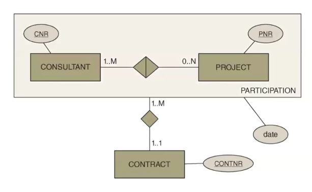

# Aggregation

## ER Diagrams

In the case where a relationship has a relationship, we can use aggregation. An example could be a relationship between consultants working on projects, where one consultant works on at least one project (`1..n`) and one project can have zero to many consultants working on it (`0..n`).  
Then apart from this relationship, there is a relationship between these project participations and a contract, where one contract has at least one consultant participating in a project that it relates to.
For the depiction in a diagram, see [ER diagram](ERdiagram.md).

