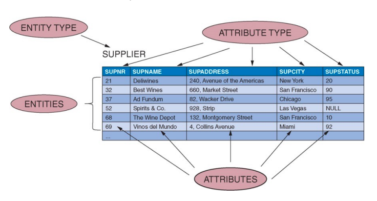
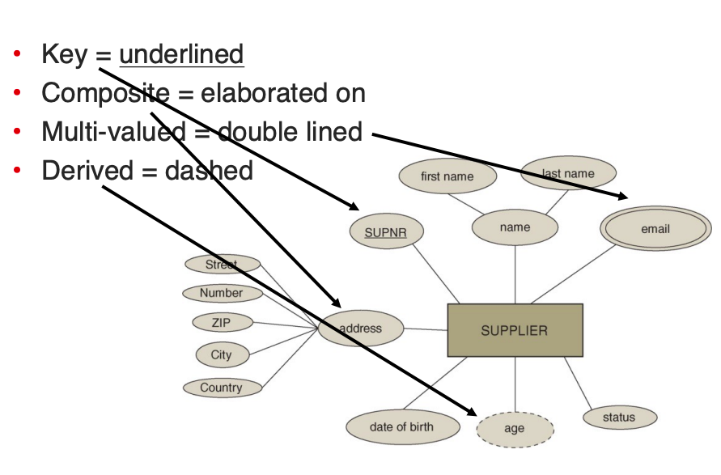
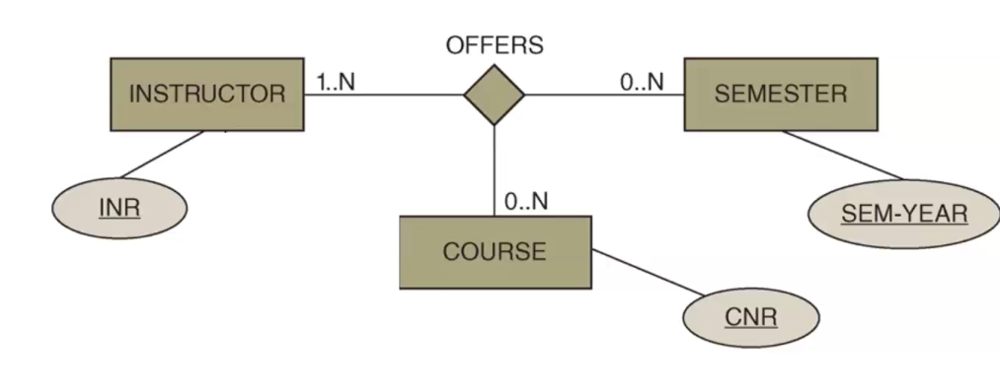
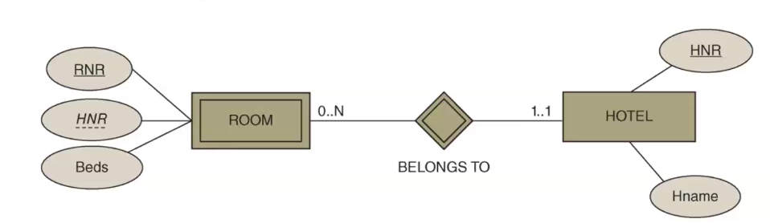
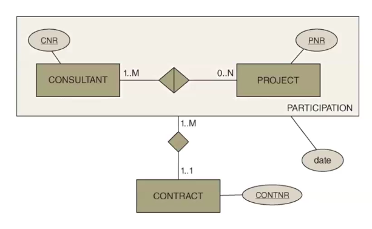
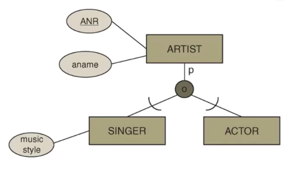

# ER Diagrams

## Design process

1. Gather requirements (Unrelated to course)
1. Conceptual design
    - Sketch key components in ER-diagram
1. Logical design
    - Transform conceptual design to DDL
1. Physical design

## Conceptual design

Depicted using ER which is not a standardized format.



Term|Explanation
--|--
Entity Type|Set of similar things/entities, e.g. Person
Entity|Record, e.g. `John, 42`
Attribute Type|Properties or columns in a database, e.g. `Name, Age`
Attribute|Specific atribute type of an entity, e.g. `John`



Attribute Types can have special characteristics:

Characteristic|Meaning
--|--
Underlined|Primary Key
Composite(Contains of several fields)|Elaborated on
Double-lined|Multi-valued
Dashed|Derived from another field

Downside: ER notation does not support secondary keys.

Dealing with **multi-valued** attribute types means creating a secondary table, such as an email table in the above example that has the two columns Email, SupplierNumber, and then view a supplier's email by using a join in any given select statement.

Dealing with **derived** values does not have a good solution, but if the format of the data can support it, a secondary table that maps from `ZIP code` to `City` could be a solution to some derived values.

Dealing with **composite values** would usually mean that the field `Address` in the above example does not exist but instead only the subfields exist in the database.

## Depiction

To show entity types, use squares, and to show attribute types, use circles. Use lines to show which entity types has which attributes.  
Relations between two entity types are shown with a diamond shape in which the key from each entity type is shown alongside a verb describing the relation, and any relation type specific attribute types are shown like regular attribute types with a line to the diamond shape.

Note that one relation type can have more than two entity types connected, e.g. a table of course offerings which both have a professor, course and semester entity type that it relates to. This uses the same depiction but with multiple lines going from the relation type to entity types.



To show the **cardinality** on a relation type, write the constraint on the line between the relation type and the entity type such as `0..N` if the entity type can have 0 or more entries in the relation type table.  
The cardinality can always be from 0 or 1 and up to either 1 or unlimited, depicted using a variable such as `N/M/L/*/...`. It is okay to use the same variable every, doesn't exactly mean that the number is always equivalent to the other place the same variable is used.

### Weak Entity Types

When an entity cannot exist without an entity in another table, such as a hotel room that cannot exist without the matching hotel in another table, then the room is a *weak entity type*.

This means that, apart from the primary key such as a room number, the room entity type also has a parent key which is the foreign key to the hotel entity type. Thus, the hotel with the same ID is the **parent** of the room, and if the parent is deleted from the database then so is all rooms that are associated with the hotel.

A *Weak Entity Type* is depicted in an ER diagram with the entity type and the relation type have double outer lines, and the parent key in the weak entity type is underlined with a dashed line like the following example:



A *Weak Entity Type* will always have a parent entity type which has a `1..1` relation, which means that there is no need for a Relation Type table, but instead the `Room` table can be created with a foreign key to the `Hotel` table as such:

```sql
CREATE TABLE Room (
    RNR INTEGER,
    HNR INTEGER
        REFERENCES Hotel(HNR),
    Beds INTEGER NOT NULL,
    Primary Key (RNR, HNR)
);
```

### Aggregation

Relations that has relations can use aggregation. See the following example:



Here, a relationship between projects and consultants exists, where projects can have zero to many consultants working on them, while consultants works on at least one project at a time.  
These participations between projects are part of contracts, where one contract has at least one participant, but there might be more than one consultant that is part of the same contract which each has an attribute type being the date they started working on the project. This uses [aggregation](Aggregation).

It is important that the relation uses foreign keys to the relationship, not each entity type indepedently, aka. **NOT** as follows:

```sql
CREATE TABLE ContractRelations (
    ConsultantID INTEGER REFERENCES Consultant(ID) -- Should be Participation(ConsultantID)
    ProjectID INTEGER REFERENCES Project(ID) -- Should be Participation(ProjectID)
    ContractID INTEGER REFERENCES Contract(ID)
)
```

### Class Hierarchy

Like Java classes. See the below example of artists which can be of the type singer or actor. There are a few things to note:

1. The arcs depict the direction of the inheritance
1. The circle coming from the parent class which denotes this has different inheritances.
1. The letter p which could also be a t:
    - p: Partial inheritance (There exists other artist types than just singers and actors)
    - t: Total inheritance (There only exists artists which are singers or actors)
1. The letter o in the small circle which can also be a d:
    - o: Overlapping (An artist can be more than one type of artist, aka both being a singer and an actor)
    - d: Disjoint (An artist can only be one subtype, thus either being a singer or an actor)


