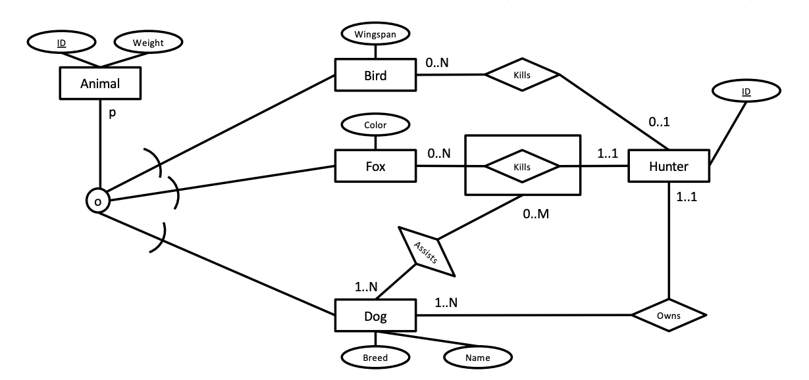

# Homework Assignment 2

Hand-in date October 17th

## 1. ER Diagram Interpretation

*Note: This exercise is intentionally designed to be confusing, to prepare you for the real world where you may encounter counter-intuitive or outright nonsensical database designs!*



In this part, consider ONLY the ER diagram above. Choose the correct statements.

- [x] All foxes have a weight.
- [ ] A hunter can kill a fox without the assistance of a dog.
- [ ] A dog can kill a bird.
- [ ] Hunters are animals.
- [ ] All animals are dead.
- [x] A hunter can kill a fox with the assistance of at least one dog.
- [x] All foxes are dead.
- [ ] A bird can be killed by many hunters.
- [ ] All birds are dead.
- [x] Given a hunter, it is possible to find the total weight of the animals he/she has killed.
- [x] A bird can be a dog.

## 2. ER Diagram Design and Implementation

A political party, the Wily And Sinister Party or WASP, has found its support waning and decided to create a database to support its operations. The WASP have already hired consultants to interview potential users, coming up with the following requirements for the database, but they need you to design their database by creating an ER diagram.

The following requirements were determined through interviews with WASP. Your database design should strictly follow the requirements definition. For example, ID columns should only be used where specifically mentioned. Where ID columns are mentioned, you can assume that they are a key

1. For people, the database should keep track of their ID, name, address, phone number, date of birth (DOB), and date of death (DOD). The default value of DOD is (thankfully!) NULL.

2. People are further divided into members of WASP and enemies; each person is a member, an enemy, or possibly both. For members, the starting date of membership is registered. Note that WASP members cannot leave the party, even in death! For enemies, the reason is registered.

3. For each WASP member, a list of their assets is maintained, which could be used to achieve the WASP agenda. Each asset of a person is identified with the name of the asset, but text fields must also be maintained to a) describe the asset in more detail and b) describe how the asset could potentially be used.

4. Events and relationships between various people (e.g. accidents, business partnership, marriage, mortal enemies, . . . ) are registered in a fairly flexible way. The WASP party uses the general term ‘linkings’. Each linking is an entity that is assigned an ID, name, type and a more detailed description. Multiple people may participate in each linking, but the minimum number of people per linking is two, and each person may participate in multiple linkings with different people.

5. Each participation of a person in a linking is monitored by one member. The monitoring member never changes.

6. The WASP party has a list of roles, each with a unique ID and a unique title, as well as a monthly salary. Members take turns filling the roles: each member may fill multiple roles at any given time, and multiple members may fill the same role. However, members may be appointed to each role only once. The start and end dates of each appointment to a role are always known in advance and recorded.

7. The WASP party keeps track of other political parties, both domestically and abroad. For each party, the country and name are a unique identifier, but the party also has an ID that serves as a primary key. For each such party, at each time (represented by start and end dates), exactly one WASP member monitors the developments in the external party.

8. The WASP party has sponsors. Each sponsor has an ID, name, address, and industry attribute. Each sponsor may give grants to a number of WASP members. For each grant, the date the grant is awarded is registered, as well as the amount and a text field called ‘payback’ that describes what the sponsor expects in return. Each sponsor may give multiple grants to multiple members, and each member can receive multiple grants from multiple sponsors. However, each grant is for a single person and each sponsor can give multiple sponsorships to each member, but at most one per day.

9. Each grant may be reviewed by one member of WASP. The date of the review is decided when the grant is registered, typically one year in the future. At review time, the grant is assigned a numerical grade from 1 to 10, depending on how well the WASP member executed the payback.

10. All parties and all enemies are two categories of opponents; opponents have an ID. Some WASP members may be assigned to oppose opponents. This opposition appointment has a start date and an end date (the latter may be unknown in the case of open-ended assignments).

Draw an ER diagram reflecting the requirements above, using the ER notation of the PDBM textbook, with amendments made in the lecture. If you draw the diagram by hand, please ensure that it is sufficiently readable.


## 3. SQL

In this homework you will work with a fictional database of countries, cities and languages. To start working with the database, run the commands in HW2.sql found in LearnIT using the PostgreSQL DBMS on your laptop. It is recommended to use psql for this purpose.

The database contains a variety of information on countries in the following schema:

```sql
continents(Continent)
countries(Code, Name, Region, ..., Population, ...)
countries_continents(CountryCode, Continent, Percentage)

cities(ID, Name, CountryCode, District, Population)
empires(CountryCode, Empire)
countries_languages(CountryCode, Language, IsOfficial, Percentage)
```

- continents has 7 entries in the database.
- countries has 239 entries in the database.
- countries_continents has 243 entries in the database.
- cities has 4079 entries in the database.
- empires has 13 entries in the database.
- countries_languages has 986 entries in the database.

Most attributes are self-explanatory. The primary and foreign keys are correctly defined, but you must study the DDL commands to understand the details of these. Some additional notes are in order:

- Some countries are present on more than one continent, and therefore have two entries in countries_continents; the Percentage attribute refers to the percentage of the population that lives on that continent.

- The table empires lists the constituent countries of some (fictional) empires. Countries that are not present in this table are not considered part of any empire.

- The Percentage data for languages in countries_languages also refers to the percentage of the population that speaks the language. The data is not complete, as the sum of percentages for countries is not 100.0 in all cases; this may be due to rounding errors or due to missing data.

- The data has various other errors, partly by design and partly because it is based on a publicly available dataset that has some errors in it.

- In cities, the District attribute refers to the region of the country where the city is located (rather than a district of the city).

Answer each of the following questions using a single SQL query on the homework database. Enter the numerical answer of each query into the LearnIT quiz. Queries should still adhere to the detailed guidelines given in Homework 1.

**(a)** The empire ‘Danish Empire’ consists of 3 countries. How many countries does the empire ‘Iberian’ consist of?

```sql
select count(*) from empires where Empire = 'Iberian'

= 3
```

**(b)** There are 4 countries that are present on more than one continent. How many of these countries are partially in Asia?

```sql
select count(distinct c1.countrycode) from countries_continents c1
join countries_continents c2 on c1.countrycode = c2.countrycode
where c1.countrycode in (select Countrycode from countries_continents
                         group by CountryCode
                         having count(CountryCode) > 1)
and c1.Continent = 'Asia'

= 4
```

**(c)** In the countries of North America that have more than 1 million inhabitants, there are a total of 164,688,674 people that speak Spanish, according to the statistics in the database. What is the corresponding number for Europe?

```sql
select sum(countries_languages.percentage * population / 100) as spanish_speakers from countries
join countries_languages on countrycode = code
join countries_continents on countries_continents.countrycode = code
where language = 'Spanish'
and continent = 'Europe'
and population > 1000000

= 29,634,696
```

**(d)** According to the database, one language is spoken in all countries of the ‘Danish Empire’. How many languages are spoken in all countries of ‘Benelux’?  
  *Note*: This is a *division* query; points will only be awarded if division is attempted.

```sql
select count(*) from (
    select language from countries
    join countries_languages on countries_languages.countrycode = code
    join empires on empires.countrycode = code
    where empire = 'Benelux'
    group by language
    having count(countries) = (
        select count(*) from countries
        join empires on countrycode = code
        where empire = 'Benelux'
    )
) temp

= 2
```

## 4. Passing Grade

The maximum grade is 60 points. You get 20 points for the ER Diagram Interpretation, 20 points for the ER Diagram Design and Implementation, and 4 points for each correct numerical answer for the SQL queries. To pass the homework, you need to have at least $8/60$ points. However, the more you do, the more feedback you get and the more you learn.
