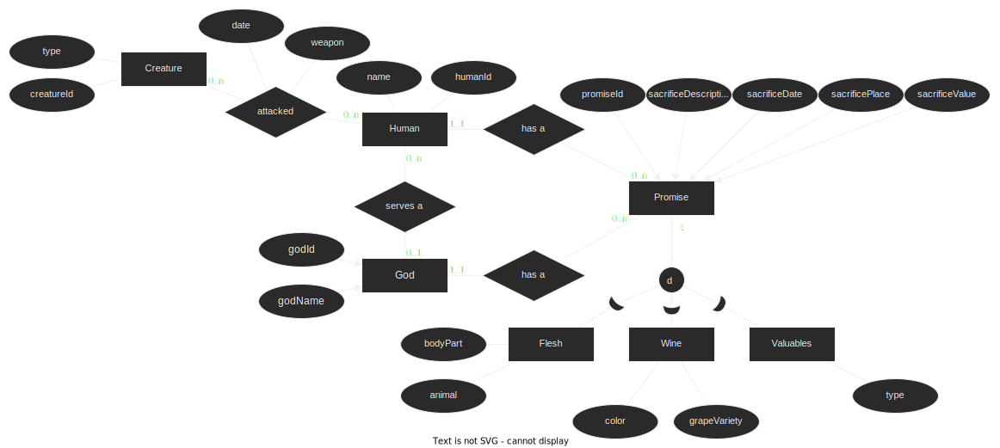

# Homework Assignment 4

Hand-in date December 5th

## 1. Hardware and DBMS Design [10 points]

### 1.A Select the correct statements below

* (a)  SSDs are especially well suited to improve the performance of retrieving large result sets using unclustered indexes.
* (b) Before a transaction can be committed, all the disk pages it has updated must be written to secondary storage to ensure durability.
* (c) In a main memory system, it is not necessary to include the “old” values when logging changes made by transactions to secondary storage.
* (d) As discussed in a lecture, Google claims to have built a distributed system that offers both consistency and availability in the face of network partitions; this proves that the CAP theorem is wrong.

My answers:

### 1.B Reflect upon why ACID transactions are rarely used in distributed systems

## 2. Data Systems for Analytics [10 points]

### 2.A Select the correct statements below

* (a) Today’s key-value stores implement all the functionality required to support *all* needs of analytics applications.
* (b) In big data, “velocity” means that it is necessary to react quickly to the large amounts of data that are being added to the system.
* (c) Emails are an example of semi-structured data.
* (d) Spark supports low-latency big data analytics.

My answers:
`c`
(`d`?)

### 2.B Consider a scenario in which you have 1PB of raw data files that have just been produced as a result of a scientific experiment. You are trying to make scientific discoveries using complex computations over this data, and also determine the experiments you would like to perform in the future. You have a cluster of machines in your lab (around 100 nodes), which have 128GB main memory and 16 cores each. Explain (with convincing arguments) what type of data management/processing system you would choose for this scenario.

## 3 Normalisation [20 points]

Consider the SQL script and the associated description in Part 2 of Homework 3. In Homework 3, you normalised the Rentals relation. Now, you are asked to normalise the Projects relation. For the Projects relation, take the following steps:

1. Find all the FDs in the relations, given the constraints and assumptions from Homework 3.
2. Decompose the relation until each subrelation is in BCNF/3NF, while preserving all non-redundant FDs. Write down the resulting schema description in a simple Relation(columns) format.
3. Write the detailed SQL commands to create the resulting tables (with primary keys and foreign keys) and populate them, by extracting the relevant data from the original relations.
4. Select the correct normal form for the decomposed schema.

For step 1, the [decompose tool](../decomposeTool.py) was used.

That lead to these [sql queries](./HW4decompose.md) to find dependencies.

Which, when run against the `projects` database led to these [findings](./HW4decomposeResult.md).

Finally, these resulted in these [queries](./queries.sql) to decompose the database.

For step 4, the normal form is now 3NF as there are no dependencies pointing to a primary key.

## 4 Godly strife (by Johan von Tangen Sivertsen) [20 points]

Zeus is tired of all the infighting among the gods. He has brought you to mount Olympus to help deal with the problem. To avoid conflicts, Zeus wants a simple database that contains a description of each promise that the gods have made to humans. That way, a god can quickly check for conflicts before making a new promise. In case conflicts arise anyway, the database should track the various sacrifices made by humans to the gods. The time, place, and items sacrificed should all be recorded. Sacrifices are divisible into one of three categories, flesh, wine, and valuables (e.g., gold, gemstones, etc.). Each category has different attributes that describe them, but they all have a value. It should be possible to sum up the total value of sacrifices a human has offered to a God to help resolve any conflicting promises.

Furthermore, some humans are appointed priests. A priest is always promised protection by his associated God, and if a sacrifice is conducted in a ceremony presided over by a priest, it is twice as valuable as normally. Any priest serves a single God. Finally, Poseidon has requested that the database also tracks if a human attacks any sea-monster or cyclops, and in that case a hecatomb should be deducted from their total sacrifice value for all gods.

1. Draw an ER-diagram that supports the requirements. Feel free to add identifiers and other attributes.



2. Write the DDL for a database according to your design.

```sql
CREATE TABLE God (
    godId SERIAL PRIMARY KEY,
    godName VARCHAR NOT NULL
);

CREATE TABLE Human (
    humanId SERIAL PRIMARY KEY,
    name VARCHAR NOT NULL,
    servesGod INT REFERENCES God(GodId)
);

CREATE TABLE Creature (
    creatureId SERIAL PRIMARY KEY,
    type VARCHAR NOT NULL
);

CREATE TABLE Attacks (
    date DateTime NOT NULL,
    weapon VARCHAR NOT NULL,
    creatureId INT NOT NULL REFERENCES Creature(creatureId),
    humanId INT NOT NULL REFERENCES Human(humanId)
);

CREATE TABLE Promise (
    promiseId SERIAL PRIMARY KEY,
    sacrificeDescription VARCHAR NOT NULL,
    sacrificeDate DateTime NOT NULL,
    sacrificePlace VARCHAR,
    sacrificeValue INT NOT NULL,
    godId INT NOT NULL REFERENCES God(godId),
    humanId INT NOT NULL REFERENCES Human(humanId)
);

CREATE TABLE Flesh (
    animal VARCHAR NOT NULL,
    bodyParty VARCHAR NOT NULL,
    promiseId INT FOREIGN KEY REFERENCES Promise(promiseId)
);

CREATE TABLE Wine (
    color VARCHAR NOT NULL,
    grapeVariety VARCHAR NOT NULL,
    promiseId INT FOREIGN KEY REFERENCES Promise(promiseId)
);

CREATE TABLE Valuable (
    type VARCHAR NOT NULL,
    promiseId INT FOREIGN KEY REFERENCES Promise(promiseId)
);
```

## 5 SQL [20 points]

### Database definition

```
Artists(ArtistId, Artist, ArtistImageUrl)
Songs(SongId, Title, ArtistId, Duration, IsExplicit, ImageUrl, ReleaseDate)
Genres(GenreId, Genre)
Albums(AlbumId, Album, AlbumImageUrl, AlbumReleaseDate)
AlbumArtists(AlbumId, ArtistId)
AlbumGenres(AlbumId, GenreId)
AlbumSongs(AlbumId, SongId)
SongGenres(SongId, GenreId)
```

### Questions

* (a) In the database, 372 songs have a duration of at most 1 minute. How many songs have a duration of over 1 hour?

```sql
select count(*) from Songs
where extract(epoch from Duration) > 3600;
```

**Answer**: 2

* (b) What is the total duration, in seconds, of all songs in the database?

```sql
select sum(extract(epoch from Duration)) from Songs;
```

**Answer**: 3.883.371 seconds

* (c) The database contains just 5 songs released in 1953. What is the largest number of songs released in a single year?  
Note: This is a very simple query. Try also to answer which year had the largest number of songs. Observe how much harder this query is!

```sql
select max(a.count) from (select count(*) as count from songs group by extract(year from releasedate)) a;
```

**Answer**: 833

* (d) The database contains 12 albums by the artist Queen. How many albums by the artist Tom Waits are in the database?

```sql
select count(*) from AlbumArtists where ArtistId = (select ArtistId from Artists where Artist = 'Tom Waits');
```

**Answer**: 24

* (e) The database contains 187 different albums with a genre whose name starts with Ele (for example, some of these have the genre Electronica). How many different albums have a genre whose name starts with Alt?

```sql
select count(distinct AlbumId) from AlbumGenres
join Genres on Genres.GenreId = AlbumGenres.GenreId
where Genre like 'Alt%';
```

**Answer**: 421

* (f) For how many songs does there exist another different song in the database with the same title?  
Note: Which join method is used by PostgreSQL to evaluate this query? Does the join method change if you have an index on Songs(Title, SongId)?

```sql
select count(distinct s1.songid) from songs s1
join songs s2 on s1.title = s2.title
where s1.songid != s2.songid;
```

**Answer**: 2072

* (g) The average number of albumIds per genreId in albumGenres is 26.5246. An album can have multiple genres. What is the average number of genreIds per albumId?

```sql
select avg(x.count) from (select count(genreid) from AlbumGenres group by albumid) x;
```

**Answer**: 1.1994069681245367

* (h) An album can have multiple genres. There are 1215 albums in the database that do not have the genre Rock. How many albums do not have the genre HipHop?

```sql
select (select count(*) from Albums) - (select count(albumId) from AlbumGenres join Genres on AlbumGenres.GenreId = Genres.GenreId where Genre = 'HipHop') as count;
```

**Answer**: 1278
