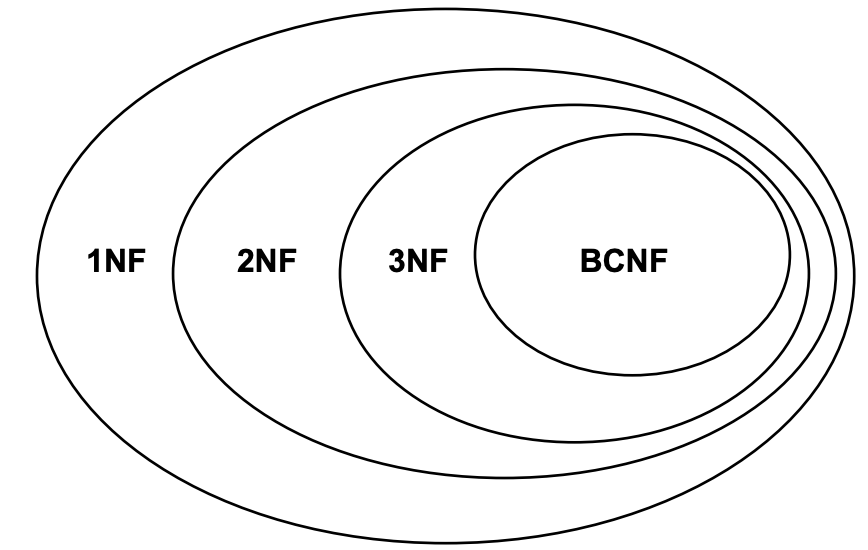
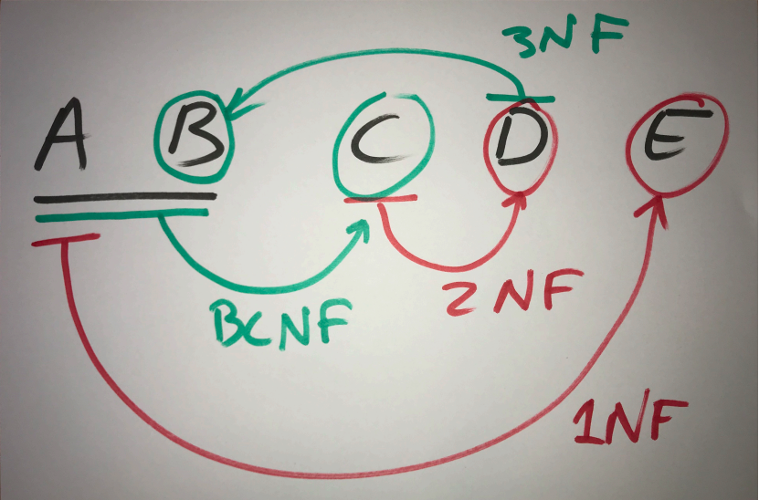

# Normalization

## Functional Dependency

In a table of people which stores their addresses, the address might be split up into several smaller segments such as streetname, housenumber, zip code and city. But since zip code and city will always be the same, we can save typing in both the zip code and the city for each address, minimizing the risk of errors.  
This means, that in the `Person` entity type table, the zip part of the address will be a foreign key to the `Zip` entity type table, which has a primary key Zip and a city name.

### Decomposing

To change the above `Person` table to now extract the zip code and city name into a seperate table, we first create the new `Zip` table, then we insert distinct values from the old `Person` table and lastly we alter the `Person` table such that it now has the foreign key Zip pointing to `Zip` and remove the City column. This looks as follows:

```sql
CREATE TABLE ZIP (
    ZIP INT PRIMARY KEY,
    City CHARACTER VARYING NOT NULL
);

INSERT INTO ZIP
SELECT DISTINCT ZIP, City
FROM Person;

ALTER TABLE Person ADD
    FOREIGN KEY (ZIP) REFERENCES ZIP(ZIP);
ALTER TABLE Person DROP COLUMN City;
```

This is a decomposition to [BCNF](#boyce-codd-normal-form-bcnf). In general, we want to decompose until we have the Third or Boyce-Codd [Normal Form](#normal-forms)

## Normal Forms

We want to optimize our database system as much as possible by improving its form. Preferably we improve the table to the [Boyce-Codd Normal Form](#boyce-codd-normal-form-bcnf).



### Third Normal Form (3NF)

When the following relation exist `R(A, B, C) C -> A` where `(A,B)` is the primary key. We note that `(B,C)` is also a key (UNIQUE).

An example of this is from Iceland:  
`Boats(Area, Number, Zip) ZIP -> Area`

**Note**: We do not normalize this.

### Second Normal Form (2NF)

When the following relation exist `R(A, B, C) C -> D` where `(A,B)` is the primary key.

### First Normal Form (1NF)

When the following relation exist `R(A, ...) A -> B` where `A` is the primary key.

### Boyce-Codd Normal Form (BCNF)

When the following relation exist `R(A, B) (A,B) -> C` where `(A,B)` is the primary key.


