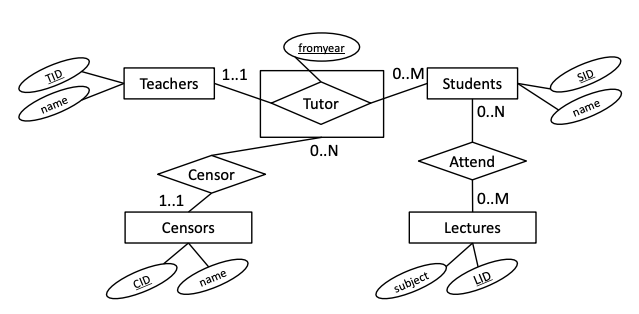
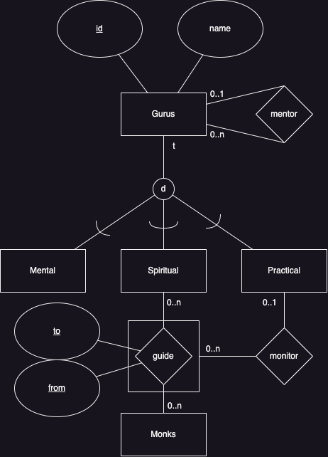

# 2021-08

Assumed points 56 / 100

## 1 SQL (40 points)

- (a) There are 8 different plants that are missing the family information. How many plants belong to the family “Thespesia”?

Answer: 18

```sql
select count(*) from plants p
join families f on f.id = p.familyid
where f.name = 'Thespesia';
```

- (b) Of the people in the database, 11 have not planted anything. How many of those, who have not planted anything, have the position “Planter”?

Answer: 9

```sql
select count(*) from people p
left join plantedin pi on p.id = pi.planterid
where pi.plantID is null and p.position = 'Planter';
```

- (c) The total area of the family “Thespesia” is 66.62 (the unit is square meters; on my machine, the exact number is 66.62000000000003). What is the total area of the family “Vicia”?
*Note: The result needs only be accurate to two digits after the decimal point.*

Answer: 27.3

```sql
select sum(pi.percentage / 100.0 * fb.size) from plantedin pi
join plants p on p.id = pi.plantid
join families f on p.familyid = f.id
join flowerbeds fb on fb.id = pi.flowerbedID
where f.name = 'Vicia';
```

- (d) The most overfilled flowerbed is planted to 105% capacity. What are the ID(s) of the flowerbed(s) with the most overfilled capacity?
*Note: The output of this query could contain more than one identifier.*

Answer: 243

```sql
drop view if exists filledpercentage;

create view filledpercentage as select f.id as id, sum(percentage) as percentage from flowerbeds f
join plantedin pi on f.id = pi.flowerbedid
group by f.id;

select fp.id from filledpercentage fp
where fp.percentage = (select max(fp.percentage) from filledpercentage fp);
```

- (e) There are 9 flowerbeds that are planted to more than 100% capacity. How many flowerbeds are planted to less than 100% capacity.

Answer: 271

```sql
drop view if exists filledpercentage;

create view filledpercentage as select f.id as id, sum(percentage) as percentage from flowerbeds f
join plantedin pi on f.id = pi.flowerbedid
group by f.id;

select count(fp.id) from filledpercentage fp
where fp.percentage < 100;
```

- (f) How many flowerbeds are planted to less than 100% capacity, and have a plant of the type “shrub” planted in them?

Answer: 169

```sql
drop view if exists filledpercentage;

create view filledpercentage as select f.id as id, sum(percentage) as percentage from flowerbeds f
join plantedin pi on f.id = pi.flowerbedid
group by f.id;

select count(distinct pi.flowerbedid) from plantedin pi
join plants p on p.id = pi.plantid
join families f on f.id = p.familyid
join types t on f.typeid = t.id
where
    t.name = 'shrub' and 
    pi.flowerbedid in (select id from filledpercentage fp where fp.percentage < 100);
```

- (g) There are 354 families that are planted in at least one flowerbed in all the parks from the database. How many flowerbeds have at least one plant of all types from the database.
*Note: This is a division query; points will only be awarded if division is attempted.*

Answer: 2

```sql
select count(*) from (select fb.id, count(distinct f.typeid) from plants p
join families f on f.id = p.familyid join plantedin pi on pi.plantid = p.id
join flowerbeds fb on fb.id = pi.flowerbedid
where p.familyid is not null group by fb.id
having count(distinct f.typeid) = (select count(id) from types))X;
```

- (h) Write a query that returns the ID and name of people, and the total area that they have planted. The list should be restricted to people who have the position “Planter” and who have planted some plant of type “flower” in the park “Kongens Have”. The total area returned, however, should not have those restrictions and should represent all the area planted by these people. The list should have the largest area first.
*Note: The readability of the solution is important for this query*

```sql
drop view if exists peopleWithPlantsInKgsHave;

create view peopleWithPlantsInKgsHave as select p.id as id, p.name as name, count(t.name) from people p
join plantedin i on i.planterid = p.id
join plants pl on pl.id = i.plantid
join families f on f.id = pl.familyid
join types t on t.id = f.typeid
join flowerbeds fb on fb.id = i.flowerbedid
join parks on parks.id = fb.parkid
where parks.name = 'Kongens Have' and t.name = 'flower' and p.position = 'Planter'
group by (p.id);

select pw.id, pw.name, sum(i.percentage / 100.0 * fb.size) as percentage from peopleWithPlantsInKgsHave pw
join plantedin i on i.planterid = pw.id
join flowerbeds fb on fb.id = i.flowerbedid
group by pw.id, pw.name
order by count(percentage) desc;
```

## 2 (BSc ONLY) SQL programming (5 points)

Select the true statements:

- **(a) Check 1 can be replaced by a CHECK constraint on the plantedin table.**
- ~~(b) Check 2 can be replaced by a CHECK constraint on the plantedin table.~~
- **(c) The first INSERT statement will fail.**
- **(d) The second INSERT statement will fail.**
- ~~(e) The third INSERT statement will fail.~~

## ~~3 (MSc ONLY) Database programming (5 points)~~

## 4 ER Diagrams and Normalization (25 points)



### a) The ER diagram in Figure 4 shows a database design for a tutoring database. Select the statements that are definitely true for any database instance, based only on the ER diagram

- ~~(a) Each teacher is connected through relationships to at least one lecture.~~
- **(b) Each teacher is connected through relationships to at least one censor.**
- **(c) Each student is connected through relationships to at most one censor.**
- ~~(d) Each student is connected through relationships to at least one censor.~~
- ~~(e) Each student may be connected multiple times to the same teacher.~~
- **(f) Each censor may be connected multiple times to the same teacher.**

### b) Write SQL DDL commands to create a database based on the ER diagram in Figure 4 using the methodology given in the textbook and lectures

The DDL script must run in PostgreSQL as a whole. The relations must include all relevant primary key, candidate key, foreign key and NOT NULL constraints. Constraints that cannot be enforced with these standard constraints should be omitted. Attributes should be of type INTEGER (including fromyear) or VARCHAR.

```sql
DROP TABLE IF EXISTS attends;
DROP TABLE IF EXISTS tutors;

DROP TABLE IF EXISTS lectures;
create table lectures (
    LID int primary key,
    subject varchar not null
);

DROP TABLE IF EXISTS students;
create table students (
    SID int primary key,
    name varchar not null
);

create table attends (
    SID int references students(SID),
    LID int references lectures(LID),
    primary key (SID, LID)
);

DROP TABLE IF EXISTS teachers;
create table teachers (
    TID INT primary key,
    name varchar not null
);

DROP TABLE IF EXISTS censors;
create table censors (
    CID INT primary key,
    name varchar not null
);

create table tutors (
    fromyear int,
    SID int references students(SID),
    TID int references teachers(TID),
    CID int not null references censors(CID),
    primary key (fromyear, SID, TID)
);
```

### c) Write an ER diagram for a guru database, based on the following requirements

The diagram should clearly show the entities, relationships, participation constraints and keys described in the text. Attributes are only important if they are mentioned in this description; you should not add other attributes. Follow precisely the notation presented in the textbook and lectures.

- Gurus have a unique identifier, and a name.
- Gurus are of one of the following types: mental, spiritual or practical. (For each type, there are many attributes, but you can ignore these.)
- Each guru may be mentored by one other guru. (Type is irrelevant here.)
- Monks are guided by one spiritual guru at each time. The time interval (to, from) of guidance must be recorded, and monks may be guided by the same guru more than once.
- Each guidance interval may be monitored by one practical guru.



### d) Consider a table R(L, M, N, O, P) with the following dependencies

```sql
LM → NOP
N → L
O → P
```

becomes

```sql
R(MNO)
R(NL)
R(OP)
```

Select the true statements:

- ~~(a) LM is the only (candidate) key of R.~~
- ~~(b) LM → P is a redundant functional dependency.~~
- ~~(c) Normalizing to 3NF/BCNF results in exactly two relations.~~
- **(d) The relation cannot be normalized to BCNF without losing functional dependencies (excluding trivial, unavoidable, and redundant dependencies).**

### e) Consider a table R(L, M, N, O, P) with the following dependencies

```sql
LM → NOP
N → OP
L → N
M → M
```

*Normalize R to the highest possible normal form (3NF or BCNF), based on functional dependencies, while allowing all functional dependencies (excluding trivial, unavoidable, and derivable dependencies) to be checked within a single relation. For each resulting relation, write its columns and clearly indicate whether it is in BCNF.*

Becomes:

```sql
Rold(LMN) # BCNF
Rnew(NOP) # BCNF
```

## 5 Index Selection (10 points)

**NB: Not done.**

## 6 DBMS Architecture (10 points)

### a) Consider a database server with persistent main memory and no secondary storage. Define the STEAL buffer management policy and discuss its usefulness for such a server

### b) Select the true statements

- **(a) Writing the log is usually slower than writing the actual updates to relations.**
- **(b) SSD storage is volatile.**
- (c) The FORCE policy is difficult to implement in reality, since committing large transactions can cause many disk writes, and the server might crash in the middle of the writing process.
- ~~(d) Query optimisation are often improved by gathering statistics over relations.~~

## 7 Transactions (10 points)

### a) Briefly discuss

- (a) what consistency means in the context of ACID transactions
- (b) how relational systems support such consistency.

### b) Select the true statements

- **(a) Locking can be used to implement isolation.**
- ~~(b) A buffer manager with a NO STEAL policy complicates the implementation of atomicity.~~
- ~~(c) Isolation and durability are mutually exclusive.~~
- **(d) Transactions are a general concept that could potentially be applied to, for example, file systems.**


```sql
drop table if exists "p" cascade;
drop table if exists "newprojects" cascade;
drop table if exists "mythologies" cascade;
drop table if exists "religions" cascade;
drop table if exists "economictheories" cascade;
drop table if exists "people" cascade;
drop table if exists "servants" cascade;
drop table if exists "serve" cascade;
drop table if exists "attack" cascade;
drop table if exists "ingredients" cascade;
drop table if exists "belong_to" cascade;
drop table if exists "cuisines" cascade;
drop table if exists "recipes" cascade;
drop table if exists "chefs" cascade;
drop table if exists "master" cascade;
drop table if exists "steps" cascade;
drop table if exists "use" cascade;
drop table if exists "flowerbeds" cascade;
drop table if exists "parks" cascade;

drop table if exists "albumgenres" cascade;
drop table if exists "albumartists" cascade;
drop table if exists "works" cascade;
drop table if exists "projects" cascade;
drop table if exists "employees" cascade;
drop table if exists "audits" cascade;

 drop table if exists "rentals" cascade;
 drop table if exists "boats" cascade;
 drop table if exists "coffees" cascade;
 drop table if exists "customers" cascade;
 drop table if exists "s" cascade;
 drop table if exists "m" cascade;
 drop table if exists "category" cascade;
 drop table if exists "service" cascade;
 drop table if exists "client" cascade;
 drop table if exists "subscribes" cascade;
 drop table if exists "basicservice" cascade;
 drop table if exists "resource" cascade;
 drop table if exists "compositeservice" cascade;
 drop table if exists "constitutes" cascade;
 drop table if exists "clients" cascade;
 drop table if exists "clients_types" cascade;
 drop table if exists "types" cascade;
 drop table if exists "newrentals" cascade;
 drop table if exists "decomposed" cascade;
 drop table if exists "genres" cascade;
 drop table if exists "artists" cascade;
 drop table if exists "songs" cascade;
 drop table if exists "songgenres" cascade;
 drop table if exists "albums" cascade;
 drop table if exists "albumsongs" cascade;
```