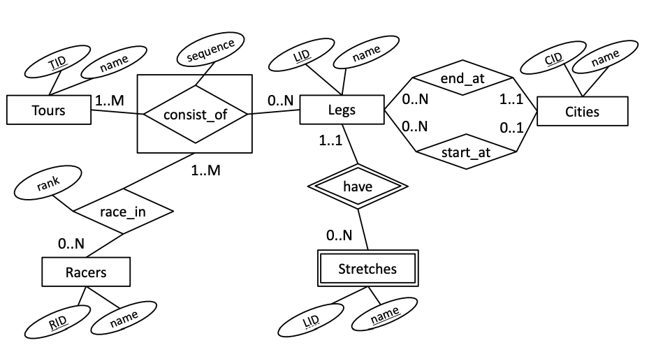
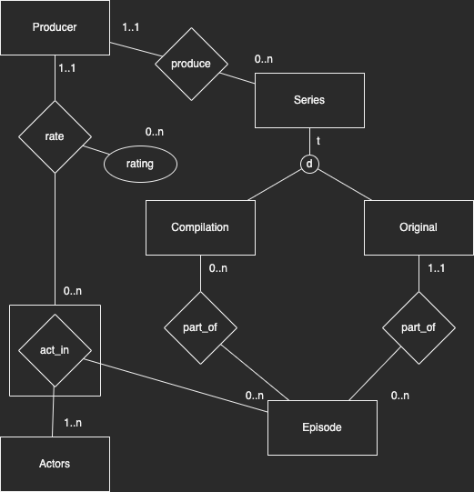

# 2021-12

Assumed points: 57 / 100

## 1 SQL (40 points)

- (a) A total of 410 chefs have created at least one recipe. How many have not created any recipes?

Answer: 6

```sql
select count(*) from (select c.name, count(r.created_by) from Chefs c
full outer join Recipes r on c.id = r.created_by
group by c.name
having count(r.created_by) = 0) X;
```

- (b) The chef ‘Foodalicious’ has mastered 56 recipes that have some ingredient(s) of type ‘spice’. How many recipes that have some ingredient(s) of type ‘spice’ has the chef ‘Spicemaster’ mastered?

Answer: 57

```sql
select count(distinct u.recipe_id) from Chefs c
join master m on m.chef_id = c.id
join use u on u.recipe_id = m.recipe_id
join ingredients i on i.id = u.ingredient_id
where i.type = 'spice' and c.name = 'Spicemaster';
```

- (c) There are 1,257 recipes in the database with 10 or more steps registered. How many recipes have 3 or fewer steps registered?

Answer: 1139

```sql
select count(*) from (select r.id, count(s.*) from recipes r
join steps s on s.recipe_id = r.id
group by r.id
having count(s.*) <= 3) X;
```

- (d) How many recipes belong to the same cuisine as at least one of their ingredients?

Answer: 251 (Wrong)

```sql
drop view if exists IngredientsInRecipe;

create view IngredientsInRecipe as
    select r.id, b.ingredient_id from recipes r
    join use u on u.recipe_id = r.id
    join ingredients i on i.id = u.ingredient_id
    join belong_to b on b.ingredient_id = i.id;

select count(distinct r.id) from recipes r
join IngredientsInRecipe i on i.recipe_id = r.id
where r.belong_to in (
    select ir.cuisine_id from IngredientsInRecipe ir where ir.recipe_id = r.id
);
```

- (e) The recipe with name ‘Fresh Tomato Salsa Restaurant-Style’ has the most steps of all recipes, or 38. What is/are the name of the recipe/s with the most different ingredients of all recipes?
*Note: The output of this query is a set of one or more recipe names.*

Answer: Dinengdeng

```sql
drop view if exists IngredientsInRecipes;

create view IngredientsInRecipes as 
    select u.recipe_id as rid, count(u.ingredient_id) as count from use u
    group by u.recipe_id;

select r.name from recipes r
join IngredientsInRecipes ir on r.id = ir.rid
where ir.count = (
    select max(ir.count) from IngredientsInRecipes ir
);
```

- (f) We define the spice ratio of a cuisine as the number of ingredients that belong to it that are of type ‘spice’ divided by the total number of ingredients that belong to the cuisine. Here we consider only cuisines that actually have spices. The highest spice ratio is 1.0, and this spice ratio is shared by 8 cuisines. How many cuisines share the lowest spice ratio?

Answer: 7

```sql
drop view if exists SpicesInRecipes;

create view SpicesInRecipes as
    select b.cuisine_id as cid, count(b.ingredient_id) as count from belong_to b
    join ingredients i on i.id = b.ingredient_id
    where i.type = 'spice'
    group by b.cuisine_id;

drop view if exists IngredientsInRecipes;

create view IngredientsInRecipes as
    select b.cuisine_id as cid, count(b.ingredient_id) as count from belong_to b
    group by b.cuisine_id;

drop view if exists Ratios;

create view Ratios as
    select sr.cid as cid, (sr.count::float / ir.count) as ratio from SpicesInRecipes sr
    join IngredientsInRecipes ir on ir.cid = sr.cid;

select count(*) from (select r.cid, r.ratio from Ratios r where r.ratio = (select min(ratio) from Ratios)) x;
```

- (g) There are 4,169 recipes that contain some ingredient of all ingredient types. How many recipes contain some ingredient of all ingredient types in the same step?  
*Note: This is a division query; points will only be awarded if division is attempted.*

Answer: 132

```sql
select count(*) from (
    select u.recipe_id, count(i.type) from use u
    join ingredients i on i.id = u.ingredient_id
    group by u.recipe_id
    having count(i.type) = (
        select count(distinct type) from ingredients
    )
) X;
```

- (h) Write a query that outputs the id and name of chefs, and total ingredient quantity (regardless of units), in order of decreasing quantity, for chefs that have created recipes in a cuisine with ‘Indian’ in the name, but only considering ingredients that belong to a cuisine with ‘Thai’ in the name.

Answer:

```sql

```

## 2 (BSc ONLY) SQL programming (5 points)

Select the true statements:

- ~~(a) The trigger prevents negative quantity values from entering the relation.~~
- **(b) The trigger ensures that only ingredients that belong to the same cuisine as the recipe can be used.**
- **(c) The first INSERT will succeed in adding a row to the table.**
- ~~(d) The second INSERT will succeed in adding a row to the table.~~
- ~~(e) The third INSERT will succeed in adding a row to the table.~~

## ~~3 (MSc ONLY) Database programming (5 points)~~

## 4 ER Diagrams and Normalization (25 points)



### a) The ER diagram in Figure 4 shows a simple database for bicycle races. Select the true statements

- (a) A racer has competed in at most 1 tour.
- **(b) A racer has competed in at least 1 tour.**
- **(c) Many stretches can have the same name.**
- **(d) Many racers can have the same name.**
- (e) Each stretch connects to at least one racer, via the relationships.
- (f) All cities are the start of some leg.

### b) Write SQL DDL commands to create a bicycle race database based on the ER diagram in Figure 4

```sql
drop table race_in;
drop table racers;
drop table consist_of;
drop table tours;
drop table stretches;
drop table legs;
drop table cities;

CREATE TABLE Cities (
    CID INT Primary Key,
    name varchar not null
);

create table legs (
    lid int primary key,
    name varchar not null,
    end_at int references Cities(CID) not null,
    start_at int references Cities(CID)
);

create table stretches (
    LID int references legs(lid),
    name varchar,
    primary key (LID, name)
);

create table tours (
    TID int primary key,
    name varchar not null
);

create table consist_of (
    TID INT references Tours(TID) not null,
    LID INT references Legs(LID) not null,
    sequence int not null,
    primary key (TID, LID)
);

create table racers (
    RID int primary key,
    name varchar not null
);

create table race_in (
    RID int references Racers(RID),
    TID int,
    LID int,
    rank int not null,
    foreign key (TID, LID) references consist_of(TID, LID),
    primary key (RID, TID, LID)
);
```

### c) Write an ER diagram for a database of television series based on the following requirements

*The diagram should clearly show the entities, attributes, relationships and participation constrains described below. Use the notation presented in the textbook and lectures. Attributes are only important if mentioned. If you need to make additional assumptions put them in the box below.*

- Series are either Original or Compilation, not both. Each type has multiple attributes, but you can ignore them in your design.
- Each series is produced by one Producer.
- Each episode is part of one Original series.
- Episodes can also be part of many Compilation series.
- Actors can act in multiple episodes. Each episode has at least one actor.
- Producers rate the acting of actors in individual episodes, with a rating attribute.



### d) Consider a table R(L, M, N, O, P) with the following dependencies

```sql
LMN → OP
L → O
P → M
N → N
```

becomes

```sql
Rold(LMNP) # 3NF
Rnew(LO) # BCNF
```

Select the true statements:

- ~~(a) LMN is the only (candidate) key of R.~~
- **(b) LMNO → P is an unavoidable functional dependency.**
- **(c) Normalizing to 3NF or BCNF results in exactly two relations.**
- ~~(d) The relation can be normalized to BCNF without losing dependencies.~~

### e) Consider a table R(L, M, N, O, P) with the following dependencies

```sql
L → MN
N → O
MN → P
```

has candidate key L

so becomes

```sql
R(L,M,N) # BCNF
R(M,N,P) # BCNF
R(N,O) # BCNF
```

## 5 Index Selection (10 points)

**NB: Not done.**

Consider the following large relation with information on products:

```sql
Products(id, name, descr, year, value, <many long attributes>)
```

The attributes id, year and value are integer values, while name and descr are strings, and none of these are nullable. Assume that name is a candidate key and value ranges uniformly from 0 to 5000. Now consider the following three SQL queries:

Query 1

```sql
select *
from Products
where name = ’The Best Product in the World’;
```

Query 2

```sql
select *
from Products
where value > 2000
```

Query 3

```sql
select year, avg(value)
from Products
group by year;
```

- (a) Indicate for each query whether a clustered index should be defined (i.e., would be preferable to a non-clustered index or no index at all). Explain your answer and define the indexes you consider.
- (b) Indicate for each query whether a covering index could be defined (i.e., would be preferable to a clustered index). Explain your answer and define the indexes you consider.
- (c) Considering all three queries, which clustered index would you define on Products? Explain your answer.

## 6 Hardware and DBMS Design (10 points)

### a) Select the correct statements below

- **(a) In a main-memory relational database system, it remains necessary to log the “old” values during updates, in case the transaction aborts.**
- ~~(b) NoSQL literally means that SQL-like query languages must not be supported by NoSQL systems.~~
- ~~(c) Document stores cannot store business data that is typically stored in relational systems.~~
- **(d) While locking whole tables guarantees serializability in a relational system, it leads to terrible performance, which is why it is turned off by default in most systems.**

### b) Discuss pros and cons of storing multiple copies of data in a geographically distributed database, compared to storing a single copy. Be sure to mention at least one advantage and one disadvantage

Pros|Cons
--|--
Failure-safe in case a database center fails|Costly to update multiple databases located different places

## 7 Data Systems for Analytics (10 points)

### a) Select the correct statements below

- ~~(a) All big data applications are evil in nature.~~
- ~~(b) Spark is designed for supporting user-facing and interactive applications.~~
- **(c) Many big data applications require so much computation that a distributed processing framework is necessary.**
- ~~(d) A machine learning model that is based on real data can never have any bias, because it accurately models real life.~~

### b) What is the the most important disk access pattern of typical big data applications? Support your answers with arguments
