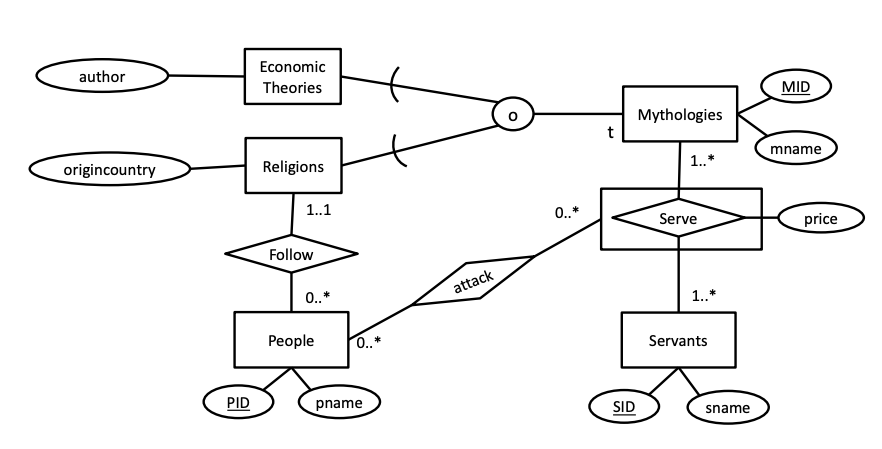
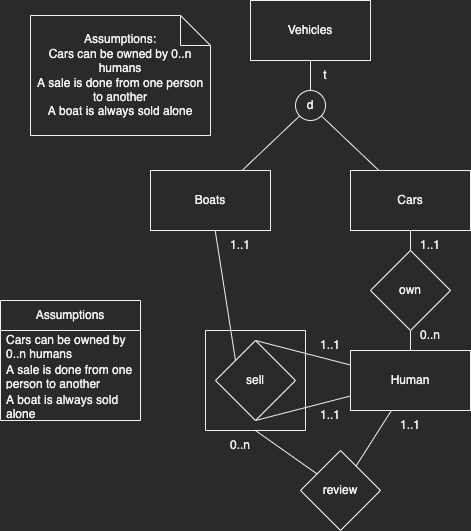

# 2022-05

Assumed points: 55 / 100

## 1 SQL (40 points)

Answer each of the following questions using a single SQL query on the examination database. Enter each query, along with its answer answer, in LearnIT. Queries must adhere to the detailed guidelines given on Page 3.

- (a) There are 461 employees with names that end with “sson” in the database. How many employees have names ending with “sdottir”?

Answer: 418

```sql
select count(*) from Employees where ename like '%sdottir';
```

- (b) The number of employees who were at least once audited with a rating above average is 1035. What is the number of the employees who were at least once audited with a rating below the average?

Answer: 933

```sql
select count(distinct e.*) from employees e
join Works w on e.eid = w.eid
join Audits a on a.wid = w.wid
where a.rating < (select avg(rating) from Audits);
```

- (c) One company policy rule is that projects should be of a type that matches one of the types that clients are registered for. However, client with cid = 1 has 105 projects which violate this rule. How many projects in total violate this rule?

**NB: This is wrong.**

Answer: 150

```sql
select count(distinct p.pid) from Projects p
join Works w on p.pid = w.pid
join Clients c on c.cid = w.cid
join Clients_Types ct on ct.cid = c.cid
where p.tid = ct.tid;
```

- (d) Furthermore, another company policy rule is that employees should not work on different project types for the same client. How many employees violate this rule of the company policy?

**NB: Uncertain.**

Answer: 2994

```sql
select count(*) from (select w.eid, w.cid, count(distinct p.tid) from Works w
join Projects p on p.pid = w.pid
group by w.eid, w.cid
having count(distinct p.tid) > 1) x;
```

- (e) The client with cid = 1 has six employees working on the project with pid = 20. Write a query to return the cid attribute of client(s) that have the most number of employees working on a single project?  
*Note: This query returns a list of (one or more) identifiers.*

Answer: 50, 38

```sql
create view EmployeeCountByClientAndProject as
Guldborg-# select w.cid, w.pid, count(w.eid) as employees from Works w
group by w.cid, w.pid;
```

```sql
select ec.cid from EmployeeCountByClientAndProject ec
where ec.employees = (
    select max(ec.employees) from EmployeeCountByClientAndProject ec
);
```

- (f) Write a query to return the highest total number of hours registered by one worker, across all projects and clients?  
*Note: This query returns a sum of hours, not a count of result rows.*

Answer: 110519

```sql
create view EmployeeWorkTime as select w.eid, sum(w.hours) from Works w
group by w.eid;

select max(ewt.sum) from EmployeeWorkTime ewt;
```

- (g) In the database, there are two projects where work has been done (worked on) for all clients. For how many different project types has work been done (worked on) for all clients?  
*Note: This is a division query; points will only be awarded if division is attempted.*

Answer: 2

```sql
select count(distinct x.tid) from (select p.tid, w.pid, count(distinct w.cid) from Works w
join Projects p on p.pid = w.pid
group by w.pid, p.tid
having count(distinct w.cid) = (select count(distinct c.cid) from clients c)) x;
```

- (h) In total, there are 7,458 audits where an employee audited some other employee (i.e., not themselves). How many employees have audited all other employees (i.e., excluding themselves)?  
*Note: This is also a division query.*

Answer: 1

```sql
select count(*) from (select a.eid, count(distinct e.eid) from Audits a
join works w on w.wid = a.wid
join employees e on e.eid = w.eid
group by a.eid
having count(distinct e.eid) = (select count(eid)-1 from employees)) x;
```

## 2 (BSc ONLY) SQL programming (5 points)

### Select the true statements

- **(a) Check 1 can be replaced by a CHECK constraint on the Audits relation.**
- (b) Check 2 can be replaced by a CHECK constraint on the Audits relation.
- **(c) The second INSERT statement will raise an error.**
- (d) The fourth INSERT statement will raise an error.

## ~~3 (MSc ONLY) Database programming (5 points)~~

## 4 ER Diagrams and Normalization (25 points)



### a) Select the true statements

- (a) All people are connected to at least one servant through the relationships.
- (b) A servant may serve no mythology.
- (c) An economic theory must be served by some servant.
- **(d) An economic theory can also be a religion.**
- **(e) People can only follow religions that are not also economic theories.**
- (f) No person (people entity) can attack any servant that serves the religion that the person follows.

### b) Write SQL DDL commands to create a database based on the ER diagram in Figure 4

```sql
DROP TABLE IF EXISTS Attack;
DROP TABLE IF EXISTS Serve;
DROP TABLE IF EXISTS Servants;
DROP TABLE IF EXISTS People;
DROP TABLE IF EXISTS EconomicTheories;
DROP TABLE IF EXISTS Religions;
DROP TABLE IF EXISTS Mythologies;

CREATE TABLE Mythologies (
    MID INT PRIMARY KEY,
    mname VARCHAR
);

CREATE TABLE Religions (
    MID INT PRIMARY KEY REFERENCES Mythologies(MID),
    origincountry VARCHAR
);

CREATE TABLE EconomicTheories (
    MID INT PRIMARY KEY REFERENCES Mythologies(MID),
    author VARCHAR
);

CREATE TABLE People (
    PID INT PRIMARY KEY,
    pname VARCHAR,
    MID INT REFERENCES Religions(MID)
);

CREATE TABLE Servants (
    SID INT PRIMARY KEY,
    sname VARCHAR
);

CREATE TABLE Serve (
    SID INT REFERENCES Servants(SID),
    MID INT REFERENCES Mythologies(MID),
    price VARCHAR,
    PRIMARY KEY (SID, MID)
);

CREATE TABLE Attack (
    PID INT REFERENCES People(PID),
    MID INT,
    SID INT,
    FOREIGN KEY (MID, SID) REFERENCES Serve (MID, SID),
    PRIMARY KEY (MID, SID)
);
```

### c) Write an ER diagram for a database of vehicles based on the following requirements

The diagram should clearly show the entities, relationships and participation constrains described below. You should not include any attributes in your design. Use the notation presented in the textbook and lectures. If you need to make additional assumptions put them in the box below.

- Vehicles may be boats or cars, but not both.
- Humans must own exactly one car.
- Humans can sell boats to other humans.
- Each such sale may be reviewed by one human



### d) Consider a table R(L, M, N, O, P) with the following dependencies

```sql
LMN → OP
O → L
N → P
```

Becomes

```sql
Rold(LMNO) # LMN -> O
Rnew(NP) # N -> P
```

This means BCNF as O -> L.

Select the true statements:

- (a) LMN is the only (candidate) key of R. (No, MNO is also)
- **(b) LMNO → P is an unavoidable functional dependency.**
- **(c) Normalizing to 3NF or BCNF results in exactly two relations.**
- (d) The relation can be normalized to BCNF without losing dependencies. (No, circular dependencies)

### e) Consider a table R(L, M, N, O, P) with the following dependencies

```sql
LMN → OP
LM → O
O → P
```

*Normalize R to the highest possible normal form (3NF or BCNF), based on functional dependencies, while allowing all functional dependencies (excluding trivial, unavoidable, and redundant dependencies) to be checked within a single relation. For each resulting relation, write its columns and clearly indicate whether it is in BCNF.*

The above becomes:

```sql
Rold(LMN)
Rnew(LMO) # LM -> O (Key: LMN)
Rnew(OP) # O -> P (Key: O)
```

All are BCNF.

## 5 Index Selection (10 points)

**Query 1:**

```sql
select title
from Movies
where producerID = 2525;
```

**Query 2:**

```sql
select count(*)
from Movies
where year = 2014;
```

**Query 3:**

```sql
select *
from Movies
where producerID = 2300 and year > 2015;
```

Answer each of the following questions:

- (a) Indicate for each query whether a clustered index would be preferable to a nonclustered index or no index at all. Explain your answer and define the indexes you consider.

- (b) Indicate for each query whether a covering index would be preferable to a clustered index. Explain your answer and define the indexes you consider.

- (c) Considering all three queries, which single clustered index would you define on the
relation? Explain your answer.

## 6 Hardware and DBMS Design (10 points)

### a) Select the correct statements below

- (a) A B+-tree index could be used to index attribute values in a single-server document store.
- (b) Consistent hashing is useful for workload balancing in a large distributed system.
- **(c) In a main-memory-based database system, there is no need for persistent storage of any kind.**
- (d) The default isolation mode of PostgreSQL is full serializability.

### b) In your own words, explain the original CAP theorem and why it is not very useful for system developers

## 7 Data Systems for Analytics (10 points)

### a) Select the correct statements below

- **(a) At its core, cloud storage uses the same storage media as local storage: HDDs and/or SSDs.**
- (b) Deep learning is often used to train classifiers that can translate unstructured multimedia data (images and video) to more structured text data.
- **(c) Data Volume alone is not sufficient to consider a collection of data to be a big data collection.**
- (d) Data is never written to storage in a big data collection.

### b) Discuss the pros and cons of using Spark to process and manage big data collections
