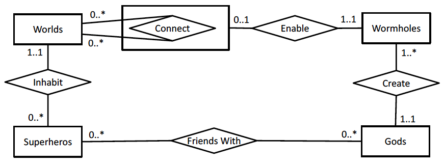
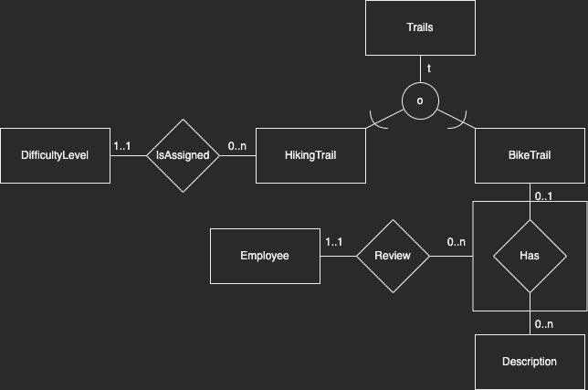

# 2022-08

Assumed points: ~69 / 100

## 1 SQL (40 points)

**(a) There are 45 services which have category “Compute”. How many services have category “Analytics”?**

Answer: 139

```sql
select count(*) from Service
join Category on Service.catid = Category.catid
where catname = 'Analytics';
```

**(b) How many composite services have no constituent basic service?**

Answer: 20

```sql
select count(*) from CompositeService cs
left join Constitutes c on c.csid = cs.csid
where c is null;
```

**(c) The cheapest basic services (with lowest BasicService.usage × Resource.price) are the services with bsid = 35 and bsid = 299. Write a query to return the identifiers of the most expensive basic services.**  
*Note: This query returns a list of (one or more) identifiers.*

Answers: 487, 500

```sql
select bs.bsid from BasicService bs
join Resource r on bs.rid = r.rid
where usage*price = (select max(usage * price) from basicservice bs join resource r on bs.rid = r.rid);
```

**(d) The resource with rid = 68 is an example of an over-consumed resource, as its total usage by all basic services is 76, which exceeds its capacity of 62. How many resources are over-consumed in this database?**

Answer: 5

```sql
select count(*) from (select r.rid from Resource r
join BasicService bs on r.rid = bs.rid
group by r.rid
having r.capacity < sum(bs.usage)) a;
```

**(e) There are 28 clients which only subscribe to composite services (i.e., they subscribe to some composite services, but no basic services). How many clients only subscribe to basic services?**

Answer: 7

```sql
select count(*) from (select c.cid, count(cs.csid) from Client c
left join Subscribes sub on sub.cid = c.cid
left join CompositeService cs on sub.sid = cs.csid
group by c.cid
having count(cs.csid) = 0 and count(sub.cid) > 0) x;
```

**(f) There are 2 clients which directly (i.e., not via composite services) subscribe to all basic services offered by the service provider. How many clients subscribe indirectly (i.e., via composite services) to all basic services offered by the service provider?**  
*Note: This is a division query; points will only be awarded if division is attempted.*

Answer: 5

```sql
select count(*) from (select sub.cid from  subscribes sub
join compositeservice cs on cs.csid = sub.sid
join constitutes con on cs.csid = con.csid
join basicservice bs on bs.bsid = con.bsid
group by sub.cid
having count(distinct bs.bsid) = (select count(bsid) from basicservice)) a;
```

**(g) The service provider wants to implement the following rule: clients which subscribe to a composite service X should not subscribe to any of the basic services that constitute the composite service X. This rule does not currently hold in the database. As an example, the client with cid = 16 would violate the rule as it subscribes to composite service with csid = 431 and its constituent basic service with bsid = 120 (as well as two other pairs of composite and constituent basic services). How many distinct clients in total would violate this rule?**

Answer: 79

```sql
create view indirectbsid as select sub.cid, bs.bsid from Subscribes sub
join compositeservice cs on cs.csid = sub.sid
join constitutes con on cs.csid = con.csid
join basicservice bs on bs.bsid = con.bsid;

create view directbsid as select sub.cid, bs.bsid from subscribes sub join basicservice bs on bs.bsid = sub.sid;

select count(*) from (select distinct a.cid from directbsid a
join indirectbsid b on a.bsid = b.bsid
where a.cid = b.cid) a;
```

**(h) Write a query that returns, for each client that subscribes to some service(s), the cid of the client and the total monthly cost of all its subscriptions.**  
*Note: This query should return one row, with two columns, for each client that has some subscriptions. You are not asked to paste in the result for this query.*

```sql
create view totaldirect as select sub.cid, sum(usage * price) as total from subscribes sub join basicservice bs on bs.bsid = sub.sid
join resource r on bs.rid = r.rid
group by sub.cid;

create view totaldirect as select sub.cid, sum(usage * price) as total from subscribes sub join basicservice bs on bs.bsid = sub.sid
join resource r on bs.rid = r.rid
group by sub.cid;

select tot1.cid, (tot1.total + tot2.total) as cost from totaldirect tot1
join totalindirect tot2 on tot1.cid = tot2.cid;
```

## 2 (BSc ONLY) SQL programming (5 points)

Select the true statements:

- **(a) Check 1 can be replaced by a CHECK constraint on the BasicService relation.**
- (b) Check 2 can be replaced by a CHECK constraint on the BasicService relation.
- **(c) The first UPDATE statement will give an error.**
- (d) The second UPDATE statement will give an error.
- (e) **The third UPDATE statement will give an error.**

### Explanation

*Why is e true? Because the basicservice with bsid=1 uses resource with rid = 33. This resource has a capacity of 187 and no other basicservice uses this resource. Thus setting the resource usage to 186 (question d) will not violate the constraint that it cannot exceed it’s capacity, but setting it to 233 will (question e).*

## ~~3 (MSc ONLY) Database programming (5 points)~~

## 4 ER Diagrams and Normalization (25 points)



### a) Select the true statements. You should base your answers only on the ER diagram

- (a) All worlds are connected to at least one other world.
- **(b) A world may be connected to itself.**
- **(c) A wormhole may exist that does not enable a connection between worlds.**
- (d) A wormhole may enable the connection of more than two worlds.
- (e) All worlds connect to at least one god through some relationships.
- **(f) All gods have created some wormhole.**

### b) Write SQL DDL commands to create a database based on the ER diagram in Figure 4

```sql
CREATE TABLE Gods (
    ID INT PRIMARY KEY,
    Name VARCHAR NOT NULL
);

CREATE TABLE Wormholes (
    ID INT PRIMARY KEY,
    Name VARCHAR NOT NULL,
    CreatedBy INT FOREIGN KEY NOT NULL REFRENCES Gods(ID) 
);

CREATE TABLE Worlds (
    ID INT PRIMARY KEY,
    Name VARCHAR NOT NULL
);

CREATE TABLE Superheros (
    ID INT PRIMARY KEY,
    Name VARCHAR NOT NULL,
    Inhabits INT FOREIGN KEY NOT NULL REFERENCES Worlds(ID)
);

CREATE TABLE FriendsWith (
    SuperheroID INT NOT NULL REFRENCES Superheros(ID),
    WorldID INT NOT NULL REFRENCES Worlds(ID),
    PRIMARY KEY (SuperheroID, WorldID)
);

CREATE TABLE Connect (
    World1 INT NOT NULL REFERENCES Worlds(ID),
    World2 INT NOT NULL REFERENCES Worlds(ID),
    WormholeID INT REFERENCES Wormholes(ID),
    PRIMARY KEY (World1, World2)
);

ALTER TABLE Wormholes ADD COLUMN EnablesConnection INT FOREIGN KEY NULL REFERENCES Connect(ID);
```

### c) Write an ER diagram for a database of trails based on the following requirements

The diagram should clearly show the entities, relationships and participation constrains described below. You should not include any attributes in your design. Use the notation presented in the textbook and lectures.

- Trails are hiking trails or biking trails, and some trails may be both.
- Hiking trails are assigned one difficulty level.
- Biking trails can have multiple descriptions. Each description applies to at most one trail.
- Each description is reviewed by one employee.



### d) Consider a table R(L,M,N,O, P) with the following dependencies

**Not done.**

```sh
L → MNOP
P → MN
O → L
```

becomes

```sql
LOP
PMN
```

Select the true statements:

- (a) L is the only (candidate) key of R.
- (b) MN → P is an unavoidable functional dependency.
- (c) Normalizing to 3NF or BCNF results in exactly two relations.
- (d) The relation can be normalized to BCNF without losing dependencies. (No, circular dependencies)

### e) Consider a table R(L,M,N,O, P) with the following dependencies

```sh
LM → N
N → O
O → P
N → L
```

Normalize R to the highest possible normal form (3NF or BCNF), based on functional dependencies, while allowing all functional dependencies (excluding trivial, unavoidable, and redundant dependencies) to be checked within a single relation. For each resulting relation, write its columns and clearly indicate whether it is in BCNF.

Becomes:

```sql
LMN # 3NF
NO # BCNF
OP # BCNF
```

## 5 Index Selection (10 points)

### Query 1

```sql
select *
from Pub
where ID = 2525;
```

### Query 2

```sql
select count(distinct publisherID)
from Pub
where year = 2020 and title like ’%covid%’
```

### Query 3

```sql
select count(*)
from Pub
where publisherID = 557;
```

### Answer each of the following questions

- (a) Indicate for each query whether a clustered index would be preferable to a nonclustered index or no index at all. Explain your answer and define the indexes you consider.

Query 1:  
A clustered index on (ID) since the index would then allow the query to run on a sorted instance of the database. No index is never the fastest, and non-clustered would only be worth it if it is covering - which it is not, as we select *.

Query 2:  
A non-clustered index on (year, publisherid, title), as we would then have it sorted by year so we can exclude most, while running a full table-scan on the title with the like clause. Then finally selecting the distinct ids.

Query 3:  
a: Clustered index on (ID) with same reasoning as for Query 1.

- (b) Indicate for each query whether a covering index would be preferable to a clustered index. Explain your answer and define the indexes you consider.

Query 1:  
No, a covering index would not be preferred, as we need all the information from the table and not just the ID.

Query 2:  
Yes, if it is covering we only need the above three columns and not all the many columns for the millions of rows of data.

Query 3:  
No as the query counts * not a single column. If the query was for count(id) then we could use a covering non-clustered index.

- (c) Considering all three queries, which single clustered index would you define on the relation? Explain your answer.

Index would be on (year, publisherid) as we only need to use these two columns sorted. For the title, we need it in a like-clause which requires a full scan anyway.

## 6 Hardware and DBMS Design (10 points)

### a) Select the correct statements below

- (a) Storing relations by columns can give significant performance boost for analytic queries.
- **(b) In a main-memory-based database system, some persistent storage is needed in case the server crashes.**
- (c) Documents in document stores always correspond to data from a single relation in a relational system.
- (d) Eventual consistency guarantees that all clients always get the latest version of data items.

### b) Discuss pros and cons of key-value stores

## 7 Data Systems for Analytics (10 points)

### a) Select the correct statements below

- (a) A well-defined relational database schema guarantees that all data in the database is correct.
- (b) Societal value is a valid reason to start a big data collection.
- **(c) Sequential reads are important for big data analytics applications.**
- (d) Big data collections only contain structured data.

### b) Briefly discuss Velocity in big data applications
