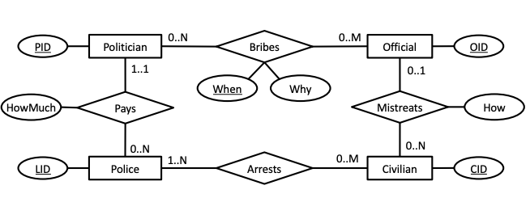

# Trial Exam december 2022

Assumed points: 70 / 100

## 1 SQL (40 points)

Answer each of the following questions using a single SQL query on the Cargo database:

- (a) In Denmark, there are 2 registered airports. How many airports are registered in Germany?

Answer: 17

```sql
select count(*) from airport where country = 'DE';
```

- (b) In Asia, there are 57 airports that have both departing and arriving flights. How many airports in Europe have both departing and arriving flights?

Answer: 185

```sql
select count(*) from airport a
join country c on a.country = c.country
where c.region = 'EU'
and a.airport in (select arr from flights)
and a.airport in (select dep from flights);
```

- (c) The average number of days that a flight route has been running is 42.77. For how many days has the longest running flight route been running?

Answer: 1572

```sql
create view flightlength as select (end_op - start_op) as len from flights;

select max(len) from flightlength;
```

- (d) There are 6126 flights that a) depart from an airport within Europe and b) have an aircraft capacity of more than 300 passengers. How many flights with more capacity than 300 passengers depart from an airport within Asia?

Aswer: 185

```sql
select count(*) from flights f
join aircraft a on a.actype = f.actype
join airport ap on ap.airport = f.dep
join country c on ap.country = c.country
where a.capacity > 300
and c.region = 'AS';
```

- (e) Each aircraft has a registered aircraft group (aircraft.ag). The smallest such aircraft group has 2 members. How many members does the largest group have?
*Hint: Using a view can simplify the query significantly. If you do, include the view creation statement in your answer.*

Answer: 24

```sql
create view agsize as select ag.ag, count(ac.*) from acgroup ag
join aircraft ac on ac.ag = ag.ag
group by ag.ag;

select max(ag.count) from agsize ag;
```

- (f) According to the flights relation, there are 124 airports with more departing flights than arriving flights. How many airports have more arriving flights than departing flights?

Answer: 182

```sql
drop view if exists arrivals;
create view arrivals as
select f.arr, count(distinct f.id) from flights f
group by f.arr;

drop view if exists departures;
create view departures as
select f.dep, count(distinct f.id) from flights f
group by f.dep;

select count(*) from (select a.airport, d.count as dep, ar.count as arr from airport a
left join departures d on a.airport = d.dep
left join arrivals ar on ar.arr = a.airport
where d.count < ar.count
or (d.count is null and ar.count is not null))X;
```

- (g) Only 1 airline has flights departing from every registered airport in Denmark. How many airlines have flights departing from every registered airport in the Netherlands?

## 2 (BSc ONLY) SQL Programming (5 points)

### Select the true statements

- **(a) The check can be replaced by a CHECK constraint on the flights relation.**
- **(b) The first INSERT statement will give an error.**
- ~~(c) The second INSERT statement will give an error.~~
- ~~(d) The third INSERT statement will give an error.~~

## 4 ER Diagrams and Normalization (25 points)



### a) The ER diagram in Figure 3 shows a database for a very corrupt society. Select the true statements. You should base your answers only on the ER diagram

- ~~(a) All policemen have made an arrest.~~
- ~~(b) All politicians have taken a bribe.~~
- **(c) Every civilian is linked to at least one politician through the relationships.**
- ~~(d) Civilians can be mistreated multiple times.~~
- ~~(e) When converted to SQL DDL according to the methodology presented in the class, the resulting database should have exactly 7 tables.~~
- **(f) When converted to SQL DDL, the table for the Bribes relationship will have a primary key with three attributes.**
- **(g) All civilians have been arrested.**

### b) Write SQL DDL commands to create the research database based on the ER diagram in Figure 3

*The DDL script must run in PostgreSQL. The relations must include all primary key, canditate key, foreign key and NOT NULL constraints. Constraints that cannot be enforced with standard primary key and foreign key constraints can be omitted. Make reasonable assumptions on the attribute types.*

```sql
create table police (
    LID int primary key
);

create table civilian (
    CID int primary key
);

create table arrests (
    LID int references police(LID),
    CID int references civilian(CID),
    primary key (LID, CID)
);

create table official (
    OID int primary key
);

create table mistreats (
    OID int not null references official(OID),
    CID int references civilian(CID),
    how varchar not null,
    primary key (CID)
);

create table politician (
    PID int primary key
);

create table mistreats (
    pid int references politician(PID),
    oid int references official(OID),
    timewhen Date,
    why varchar not null,
    primary key (pid, oid, timewhen)
);

create table pays (
    PID int not null references politician(PID),
    LID int references police(LID),
    howmuch int not null,
    primary key (LID)
);
```

### c) Consider Figures 4 and 5 as well as the following relations and constraints for a wholesale database

- (a) Each salesman has taken zero, one, or more courses. Each course has a name and hours. For each salesman, the name of the course is unique.
- (b) Salesmen can supervise products. Each product has exactly one supervisor.
- (c) Salesmen can sell all products to all customers.
- (d) Each salesman can sell the same product to the same customer multiple times, but only once per day.
- (e) Sales are sometimes reviewed by auditors. Each sale can be reviewed by at most one auditor.

Figures 4 and 5 show two possible ER diagrams for this database. Select the correct diagram and justify your answer. Furthermore, write down the cardinality for each blank box (from a to i).

Figure 4, as the salesmen id is part of the key and can thus not be null. Since the SID references the salesmens ID, a course cannot exist without being connected to at least 1 salesman.

- a: 1..1
- b: 0..n
- c: 0..n
- d: 0..n
- e: 0..n
- f: 1..1
- g: 0..n
- h: 1..n
- i: 0..1

### d) Consider a table R(A, B, C, D, E) with the following dependencies

```sql
A → C
C → A
D → E
A → BCDE
```

becomes

```sql
R(A,B,C,D) # BCNF
Rnew(D,E) # BCNF
```

Select the true statements:

- ~~(a) A is the only key of R.~~
- **(b) BCD → D is a trivial functional dependency.**
- **(c) Normalizing to BCNF results in exactly two relations.**
- **(d) The relation Z(A, B, C, D) is in BCNF.**

### e) Consider a table R(A, B, C, D, E) with the following dependencies

```sql
AC → B
DE → ABC
DE → D
A → C
```

*Normalize R to the highest possible normal form (3NF or BCNF), based on functional dependencies, while allowing all functional dependencies (excluding trivial, unavoidable, and redundant dependencies) to be checked within a single relation. For each resulting relation, write its columns and clearly indicate whether it is in BCNF.*

becomes

```sql
R(D, E, A) # BCNF, key D,E
R(A, C) # BCNF, key A
R(A, B) # BCNF, key A
```

## 5 Index Selection (10 points)

Consider the following large relation with information on employees:

`Emp (id, name, age, sal, <many long attributes>)`

Assume that the attribute sal follows a normal distribution with a maximum value of 50, and the attribute age follows a uniform distribution between 25 and 75. Additionally, consider the following three SQL queries:

Query 1:

```sql
select id, name
from Emp;
```

Query 2:

```sql
select id
from Emp
where age > (select max(sal) from Emp);
```

Query 3:

```sql
select age
from Emp
where sal = (select avg(sal) from Emp);
```

Answer each of the following questions:

### (i) Select the correct statements in the following

- (a) Query 1 can only benefit from a covering index. Otherwise, a full table scan is preferable. `Full table scan`
- **(b) Query 2 will benefit from an index on sal.**
- ~~(c) For Query 2, an unclustered index on age will perform better than a clustered index on age.~~
- ~~(d) Query 3 will benefit from an index on age.~~
- ~~(e) For Query 3, a clustered index on sal will perform the same as an unclustered index on sal.~~

### (ii) Indicate for each query whether a covering index would be preferable to a clustered index. Explain your answer and define the indexes you consider

Query 1:
No, as it requires a full table scan anyway.

Query 2:
A covering index on (age, id) and a separate on (sal) would benefit, as it would be possible to query the max value of sal and then do a scan on age and grab the id without accessing data files.

Query 3:
No, as it must read all entries regardless because of the aggregate function `avg(sal)` in the subquery.

### (iii) Considering all three queries, which single clustered index would you define on the relation? Explain your answer

Since query 1 does not benefit from an index, as it requires a full table scan, we consider merely query 2+3.
Considering age, which is bounded by 25 and 75, does not contain as many records above the max of sal, query 2 would return a small amount of records. Thus, a clustered index on age would benefit here.
As query 3 checks all sal values in the aggregate function `avg(sal)`, it does not speed up the query having an index on sal.

## 6 Hardware and DBMS Design (10 points)

### (i) Select the correct statements below

- **(a) It is easier to achieve serializability when transactions take a short time to be executed.**
- ~~(b) Data replication in a distributed system eliminates the risk of losing data.~~
- **(c) Compared to older persistent storage technology, solid state disks (SSDs) are particularly effective for small random reads.**
- ~~(d) The notion of consistency in the CAP theorem is the same as the notion of consistency in ACID.~~

### (ii) Imagine that 10 years from now a new type of persistent storage emerges that is a) as fast as regular memory and b) similarly priced, making it feasible to replace main memory with this new storage medium. Compared to traditional relational management systems, how could the implementation of ACID transaction processing be simplified for servers that replace RAM with this new storage medium?

## 7 Data Systems for Analytics (10 points)

### (i) Select the correct statements below

- **(a) Sequential disk writes are the most important disk access pattern in big data analytics.**
- (b) In Big Data applications, “velocity” has two potential meanings: a) that data is added very rapidly, and b) that one must react rapidly to the added data in many cases.
- (c) MapReduce is a parallel programming model.
- ~~(d) In Big Data applications, it is important to verify that the data is clean and applicable to the analysis that is to be undertaken.~~

### (ii) Discuss the pros and cons of using Spark to implement interactive big data applications
