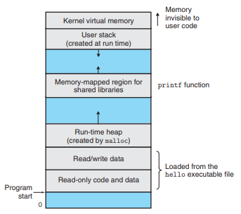

# Computer Systems

## Compilation System

Includes Four phases:

### Preprocessing phase (cpp)

Modifies the original program according to directives beginning with '#', e.g., `#include <stdio.h>` reads and inserts the system header file `stdio.h` into the program text and creating a new C program, typically with `.i`-extension.

### Compilation phase (cc1)

Compiles the preprocessed `.i`-file into a text-file with `.s` extension containing an assembly-language program.

### Assembly phase (as)

Translates the assembly `.s`-file into machine language instructions, packaged as a relocatable object program stored in the object file with extension `.o` as a binary file.

### Linking phase (ld)

Merges standard files with the program in the file, such as when calling the standard `printf` function, then the linking phase makes sure the precompiled object file `printf.o` is merged into the resulting executable object file.

## Hardware Organization

### Buses

Electrical conduits that carry bytes of information, usually fixed-size chunks of bytes known as `words`. The `word size` is a system parameter varying from system to system, often 4 or 8 bytes (32 vs 64 bits).

### I/O Devices

Keyboards, mouse, displays and a disk drive for long-term storage of data and programs. All devices are connected to the I/O bus using a controller or an adapter. Controllers are chips on the motherboard whereas adapters are cards plugged into the motherboard, both with the purpose of transferring information back and forth.

### Main Memory

Temporary storage device. Physically, it consists of dynamic random access memory (`DRAM`). Each machine instruction consists of a variable number of bytes, where as data items vary according to type, e.g., `short` of 2 bytes, `int` and `float` of 4 bytes and `long` and `doubles` of 8 bytes.

### Processor (CPU)

Engine that interprets/executes instructions from main memory. At any point in time, the program counter (`PC`) points to some machine-language instruction in main memory. While the computer is turned on, the PC repeatedly executes the instruction that it is pointing to and updates the PC according to the instruction execution model. The few simple operations available revolve around the main memory, the register file and the arithmetic/logic unit (`ALU`). Some example operations:

* Load: Copy a byte/word from main memory into a register
* Store: Copy a byte or a word from a register to a location in main memory
* Operate: Copy the contents of two registers to the ALU, perform an arithmetic operation on the two words and store the result in a register
* Jump: Extract a word from the instruction and copy that word into the PC

### Caches

It is faster for the processor to read from the smaller storage devices than the bigger ones due to physical laws, resulting in the creation of "cache memories" that are smaller and faster storage devices that temporarily saves information that the processor will likely need again in the near future.

* L1 cache: ~Tens of thousands of bytes and can be accessed almost as fast as register files
* L2 cache: ~Hundreds of thousands to millions of bytes, typically 5x as slow as an L1 cache, but still a lot fster than accessing main memory.
* L3 cache: For newer and powerful systems only

Implemented using static random access memory (`SRAM`).

### Memory hierarchy

The general idea is that getting information from the main memory (L4) goes through lower levels (L3-L1) before getting to the register files (L0), storing the information temporarily and thus potentialy saving time to read the same data multiple times if exploited correctly.

## Operation Systems managing Hardware

As shown in the below graph, applications cannot access the hardware directly, but instead communicates through the operating system.

As shown above, operating systems provides abstractions that applications can use for the hardware parts.

### Processes

The abstraction for programs, creating the illusion that one application runs at a time with full exclusive access to the hardware. In reality, multiple processes runs concurrently and often more processes than there are CPUs to run. Using `context switches`, a processor is able to switch from one `state` to another and thus continue on a different process without losing the state of the previous (and next) process(es).
The operation system `kernel` keeps track of the processes. The kernel is always resident in memory.

### Threads

It is easier to share data between multiple threads than processes, and multiple threads can run on the same process using the same code and context of one process. These are increasingly more important, e.g., in the context of network servers etc.

### Virtual memory

Virtual memory provides each process with the illusion that it has exclusive use of the main memory. Consists of the following parts:

#### Program code and data

Fixed size data and that is loaded from the executable file.

#### Heap

The run-time heap dynamically resizes during run-time, as a result of calls to C standard libraries such as `malloc` and `free`.

#### Shared libraries

Code and data from shared libraries such as the C standard library and the math library.

#### Stack

Similar to the heap, the user stack resizes dynamically during run-time. In particular, each function call is added to the stack and removed when we return from the function.

#### Kernel virtual memory

Code from the kernel that is not accessible from application programs, neither with read or write access.

### Files

Using a small set of system calls known as `Unix I/O`, I/O devices are represented as files and reading and writing to these.

## Networks

As systems are comprised of not just one but multiple computers in modern uses, we can abstract network as just another I/O device that, instead of reading and writing memory to a disk, instead does so to an external server or peer client, e.g., allowing for communication across the internet.

## Amdahl's Law

Gene Amdahl made a simple formula to describe the speedup of a system part, given the time `T_old` for a process, a fraction indicating how much of the overall system time `a` and that the speed of this part is improved by a factor of `k`, then we have the new time for the part as `T_new = (1-a)*T_old + (a*T_old)/k`.

We can thus compute the speedup as `S=1/((1-a)+a/k)`.

As an example:

A process, consuming 60% of the total time (`a=0.6`), is sped up by a factor of 3 (`k=3`), giving a speed-up of `1/((1-0.6)+0.6/3)=1.667 times`. Thus can be deduced that to give an overall speed-up of a full system, all large fractions must be speed-improved, as each individual speed-up is not as significant in general as it is in the individual process.

One thing to note is that speeding up a large part of a system virtually to an infinite degree, e.g., speeding up 60% of a program to virtually no time at all (infinite), we would get an overall increase of only `S = 1 / 0.4 = 2.5 times`.

## Concurrency

I.e., running more than one process simultaneously. `Parallelism` is in this context used to describre how using concurrency to make a system run faster.

In order of highest to lowest level of concurrency:

### Thread-Level concurrency

Threads allow for concurrency within processes. Traditionally, this was simulated by quickly switching between executing processes allowing multiple users to interact at once, even among different applications, known as a `uniprocessor system`.

With multiple processors under the control of a single operating system kernel, we have a `multiprocessor system`. 

`Hyperthreading` or `simultaneous multi-threading` is a technique allowing a single CPU to execute multiple flows of control by having multiple copies of the CPU hardware, including programming counters (`PCs`) and register files. A conventional processor requires around 20,000 clock cycles to shift between different threads, a hyperthreaded processor decides which of its threads to execute on a cycle-by-cycle basis. 

### Instruction-Level Parallelism

At a lower level, one processor can execute multiple instructions simultaneously. Traditionally, one instruction would take multiple cycles to execute (i.e., reading, computing and writing the result). Modern processors can do these in parallel, where each of these sub-instructions can be done by different parts of the processor simultaneously with other instructions different sub-instructions. Simple hardware design thus allows for execution rates close to 1 instruction per clock cycle.

Processors that can do more than 1 instruction per cycle are known as `superscalar processors`, supported by most modern processors.

### Single-Instruction Multiple-Data (SIMD) Parallelism

Mostly used to imrpove applications that processes images, sound and video data, modern processors allows multiple instructions to calculate simultaneously, e.g., adding 8 pairs of single-precision floating-point numbers in parallel.