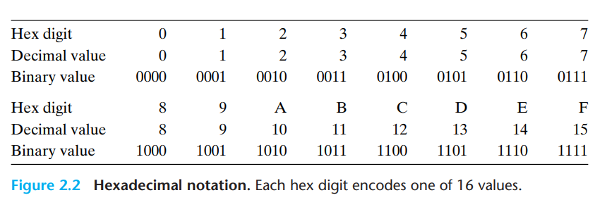
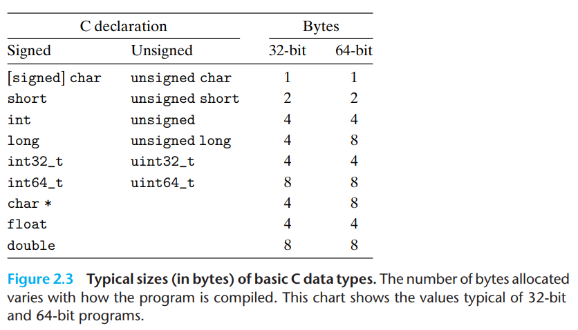
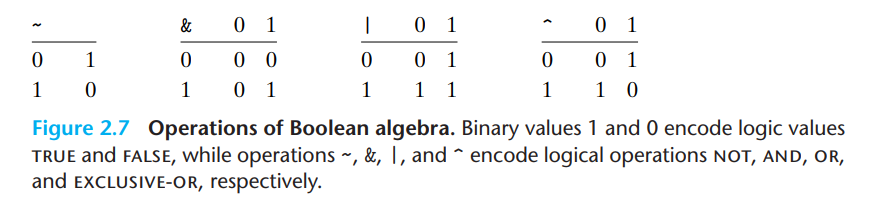
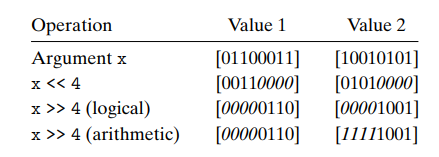

# Data

## Bytes

A byte consists of 8 bits, such that a value ranges from `00000000` to `11111111`, which in decimal notation corresponds to a range of 0-255. Since it is difficult to read bits with binary notation, and decimal numbers don't convert easily to and from the range 0-255, we instead use *hexadecimal* numbers. This uses digits 0-9 and letters A-F to give a range of 16 possible values, and with two of these we get a range of `16^2 = 256` values.

In C, numeric constants beginning with 0x or 0X are interpreted as hexadecimal values.

### Byte ordering

Bytes can either be ordered with most significant bit to the left and least significant bit to the right (like we read regular numbers), also called *big endian*, or it can be ordered as *little endian* referring to having the least significant bit to the left and the most significant bit to the right. For computers, as long as it is consistent, there are no differences in how it is used. But issues arise if data between two computers that have different byte orderings happen, thus there are very rigorous conventions for network traffic to avoid this.

## Word size and virtual address space 

Recall word size from [week 35](wk_35.md#buses). With a word size of `w`, in order for addresses to fit within the word size, they can at maximum have access to `2^w` bytes, thus for 32-bit machines, it has a maximum virtual address space of `2^32 ~= 4*10^9 = 4GB`. On the other hand, 64-bit machines have access to `2^64 = 1.84 * 10^19 ~= 16 exabytes`.

## Data sizes

## Boolean Algebra

Boolean algebra is defined as math on the two-element set `{0, 1}` representing `false` and `true` respectively.

These have the following operations:
- `~` (NOT)
- `&` (AND)
- `|` (OR)
- `^` (Exclusive OR)

This algebra can be extended to bit-vectors, where a bit-vector has a fixed length `w`, such that for the `~`-operator, all bits are negated individually, whereas the others operate on two equal-length vectors such that the resulting vector will be equivalent to doing the boolean operation on the two bits in the same place of the bitwise vectors. I.e., if vectors `a` and `b` resulting in vector `c` such that an operator, e.g. `&`, is calculated as follows: `c[i] = a[i] & b[i]` for all `i` where `0 <= i < w`.

This gives us the application that on bit-vectors, `|` and `&` corresponds to set union and set intersection, respectively. `~` corresponds to set complement.

## Logical Operations in C

Very similar to boolean algebra, operators `||`, `&&` and `!` corresponds to the logical operations OR, AND and NOT respectively. This looks similar to the boolean algebra, but where the boolean algebra operates on bits and bit-vectors, the logical operations treat any nonzero argument as true and any argument 0 as false. Where `0xFF & 0x02 = 0x02` as it is equivalent to `11111111 & 00000010 = 00000010`, then `0xFF && 0x02 = 0x01` as it will treat `0xFF` as `true` and `0x02` as `true`, thus `true && true = true` which is represented by `0x01`.

Apart from that, logical operators `||` and `&&` only evaluate their right-hand-side if the operation cannot be evaluated from the left-hand-side alone. I.e., `a && 5/a` will never cause a divison by 0 error, as `a` is guaranteed to be non-zero.

## Shift operations in C

Using the syntax `a << b`, the bit-vector `a` will be shifted `b` elements, such that the bit-vector is shifted `b` elements to the left, effectively removing the `b` most significant bits and padding (from right) with `0`s.

For right shifts, there are two types. Logical and arithmetic, where the logical always pads (from left) with `0`s, where as the arithmetic right shift pads with the same bit as the most significant bit.

Note that C does not have a standard for either using logic or arithmetic right shifts for signed numbers, meaning there might be a difference in the outcome when running this code on different systems. It is however often assumed to use arithmetic right shifts. In Java, `>>` shifts arithmetically while `>>>` shifts logically.

Another thing to note is that shifting by an amount greater than the word length can cause incosistent behaviour as well. Many systems effectively does the modulo operator on the shift-amount such that for a word-length `w` and a shift-amount of `k` where `k >= w`, it will shift `k mod w` bits instead. Java guarantees to shift using this modulo fashion but it is not guaranteed for C.

Last thing to note is that addition and subtraction takes precedence over bit-shift operations, thus the expression `1<<2 + 3<<4` is equivalent to `(1 << (2+3)) << 4`.
