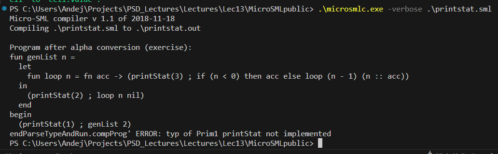
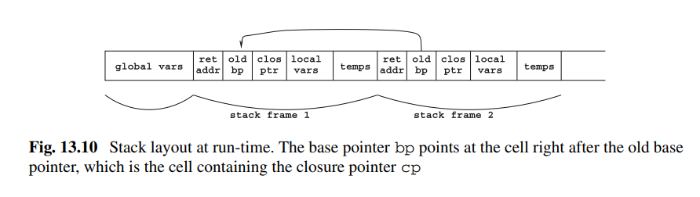
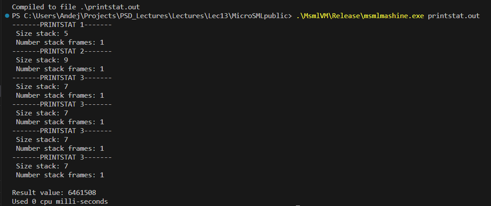
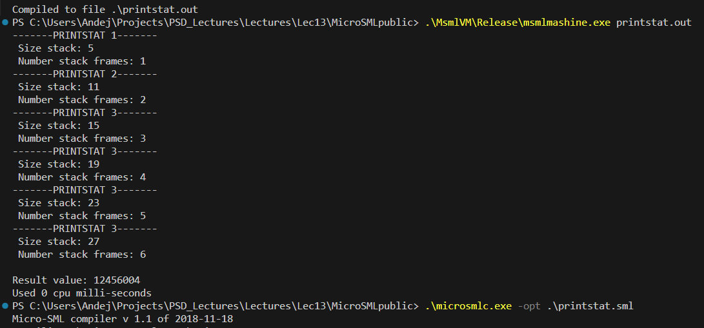
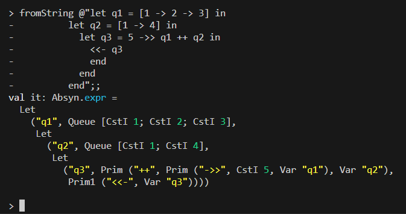
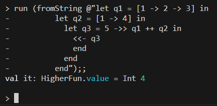
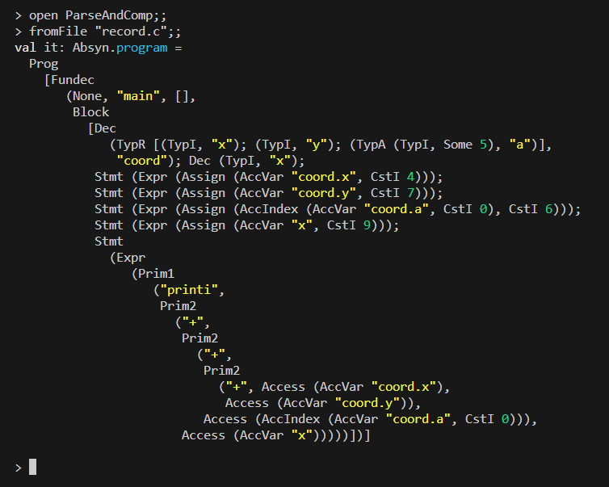
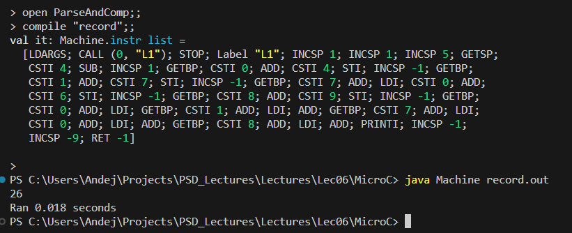
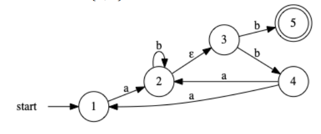
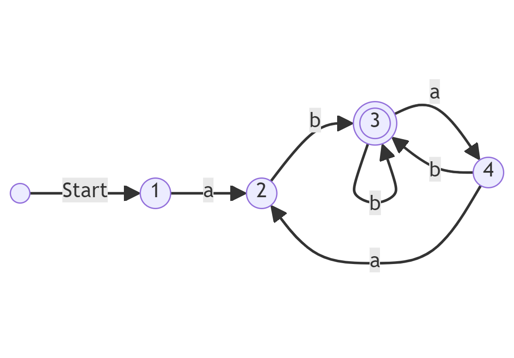

*Jeg erklærer hermed at jeg selv har lavet hele denne eksamensbesvarelse uden hjælp fra andre.*

# 1 (20%) Icon

## 1.1 
> Skriv et Icon udtryk, som udskriver værdierne 5 6 7 8 9 10 11 12 på skærmen:
> ```sh
 > run ...;;
> 5 6 7 8 9 10 11 12 val it : value = Int 0
>```
> hvor ... repræsenterer dit svar. Forklar hvorledes du får udskrevet alle 8 tal.

Ved at bruge `FromTo(5, 12)` får jeg en sequence fra 5-12 (inklusive). Den beder jeg om at skrive til terminalen (side-effekt) ved at enkapsulere det i `Write()`. Dog stopper Icon efter første resultat, men ved at skrive `Every()` tvinger vi den til at backtrace for alle muligheder i sekvensen 5-12. Uden `Every` havde Icon altså været "tilfreds" efter at have printet 5 og termineret.

```sh
> run (Every (Write (FromTo (5,12))));;
5 6 7 8 9 10 11 12 val it: value = Int 0
```

## 1.2

> Skriv et Icon udtryk, som udskriver alle tal n mellem 3 og 60, hvor 3 går op i tallet n:
>```sh
> > run ...;;
> 3 6 9 12 15 18 21 24 27 30 33 36 39 42 45 48 51 54 57 60 val it : value = Int 0
>```
> hvor ... repræsenterer dit svar. Det er et krav at FromTo indgår i din løsning, f.eks. FromTo(1,20).
> Du skal forklare hvordan din løsning fungerer.

Ligesom den forrige bruger vi dog nu også den abstrakte syntax for multiplikation, således at imellem steppet, hvor tallet i sekvensen bliver genereret (`FromTo`), og hvor vi skriver det til terminalen (`Write`), der ganger vi det med konstanten 3. Sammen med `Every` printer vi altså alle tal fra 1-20 efter de er ganget med 3.

```fs
> run (Every (Write (Prim("*", CstI 3, FromTo(1, 20)))));;
3 6 9 12 15 18 21 24 27 30 33 36 39 42 45 48 51 54 57 60 val it: value = Int 0
```

## 1.3

> Skriv et Icon udtryk, som udskriver alle tal n mellem 4 og 61, hvor 3 går op i n − 1:
> ```sh
> > run ...;;
> 4 7 10 13 16 19 22 25 28 31 34 37 40 43 46 49 52 55 58 61 val it : value = Int 0
> ```
> hvor ... repræsenterer dit svar.
>
> **Hint**: Du kan med fordel tage udgangspunkt i løsningen til spørgsmål 2 ovenfor.

Ligesom løsningen fra før, tilføjer vi bare endnu et step mellem sekvens-genereringen og der hvor vi skriver til terminalen. Ved at gange tallene fra 1-20 med 3 får vi sekvensen fra før, men inden vi printer ligger vi én til alle tal så 

```fs
> run (Every (Write (Prim("+", CstI 1, Prim("*", CstI 3, FromTo(1, 20))))));;
4 7 10 13 16 19 22 25 28 31 34 37 40 43 46 49 52 55 58 61 val it: value = Int 0
```

## 1.4
> Udvid implementationen af Icon med en ny generator RandomFromList(N,xs), som genererer N tilfældigt udvalgte heltal fra listen af heltal xs. Det antages, at N > 0 og xs er en ikke tom liste af heltal.  
> Generatoren RandomFromList(N,xs) fejler med det samme, hvis N ≤ 0 eller xs er den tomme liste.
>
>Eksempelvis giver
>```sh
> > run (Write(RandomFromList(1,[42])));;
> 42 val it : value = Int 42
>```
>Nedenstående eksempel kan give tre andre udvalgte tal når du kører det.
>```
> > run (Every(Write(RandomFromList(3,[1;2;3;4;5]))));;
> 4 4 3 val it : value = Int 0
>```
>Du kan bruge .NET klassen System.Random til at vælge tal tilfældigt fra xs. Vis koden for din implementation af RandomFromList.

For at implementere dette, har jeg først udvidet `expr`-typen med vores `RandomFromList`. Derudover har jeg deklareret et randomisation-objekt `rnd` (for at undgå, at de random tal altid bruger samme seed). Til sidst har jeg tilføjet til vores `eval`-funktion, både hvordan den skal håndtere den tomme liste, samt et rekursivt loop der håndterer at tilføje `N` tilfældige tal ved brug af vores `rnd` objekt. 

```fs
type expr = 
  ...
  | RandomFromList of int * int list
  ...
let rnd = new System.Random();
...
let rec eval (e : expr) (cont : cont) (econt : econt) = 
    ...
    | RandomFromList(n, xs) -> 
      match (n, xs) with
      | (_, []) -> econt ()
      | (_, _) -> 
        let rec loop i = 
          if i > 0 then
              cont (Int (List.item (rnd.Next(0, List.length xs) ) xs)) (fun () -> loop (i-1))
          else
              econt ()
        loop n
    ...
```

I stedet for at lave en nested match-case i `eval`-funktionen, havde det også været muligt at tjekke for den tomme liste i `if`-klausulen, men da det inderste loop køres flest gange har jeg valgt denne løsning for en lille optimering.

## 1.5

> Definer test eksempler, som tester relevante grænsetilfælde af din implementation af RandomFromList(N,xs).
> Kør og vis uddata for alle dine test eksempler. Eksempelvis tester nedenstående, at der for N lig 0 ikke genereres et tal fra listen xs.
>```sh
> > run (Every(Write(RandomFromList(0,[1;2;3;4;5]))));;
> val it : value = Int 0
>```

Test for N = 0 fejler er beskrevet ovenfor.  
Test for N < 0 fejler:
```sh
> run (Every(Write(RandomFromList(-3,[1;2;3;4;5]))));;
val it : value = Int 0
```

Test for den tomme liste fejler:
```sh
> run (Every(Write(RandomFromList(5,[]))));;
val it: value = Int 0
```

Test for N > længden af listen ikke fejler:
```sh
> run (Every(Write(RandomFromList(12,[1;2;3;4;5]))));;
5 2 1 3 2 1 1 2 5 5 2 2 val it: value = Int 0
```

Test for, at både minimum og maximum element fra listen kan vælges:
```sh
> run (Every(Write(RandomFromList(5,[1;2]))));;
1 1 2 1 1 val it: value = Int 0
```

<div style="page-break-after: always;"></div>

# 2 (25%) Micro-SML: Print statistik

## 2.1

> Det fremgår ovenfor, at der maksimalt er et stack frame når det optimerede program kører. Når det ikke optimerede program kører er der op til 6 stack frames. Forklar hvad der er årsagen til dette. Du skal være præcis i din argumentation, med reference til alle relevante steder i koden printstat.sml, for at få fuld point.

`genList` kan drage nytte af optimeringsflaget når programmet compiles, da `genList` er en tail-recursive funktion. Med andre ord er det rekursive kald det sidste, der evalueres. Det skyldes, at `genList` gør brug af en accumulator `acc`, som tillader at lægge `n` til den akkumulerede liste før det rekursive kald. Det gør, at programmet ikke behøver at bruge en stackframe på at holde de resultater, som skal bruges i evalueringen når man når det dybeste rekursive kald. Både `(n-1)` og `(n::acc)` kan evalueres inden det rekursive kald.

Havde vi ikke haft en tail-rekursiv funktion, ville vi i stedet have skullet vente på, at det sidste rekursive kald evalueres, før denne kan blive brugt til at evaluere resultatet af det næst-sidste rekursive kald og så fremdeles. I stedet kan compileren optimere de her tail-rekursive funktioner, således at vi ikke behøver at gemme midlertidige stack-specifikke resultater men kan genbruge den samme stackframe til næste rekursive kald.  

`genList` løser dette ved at definere funktionen `loop` der kaldes rekursivt men tilføjet et ekstra parameter end `genList` oprindeligt gør. Dette parameter er `nil`, som svarer til den tomme liste (Base-casen af et ikke-tail-rekursivt kald havde været den tomme liste eller en liste med kun det sidste element).

## 2.2

> Du skal udvide lexer FunLex.fsl med support for printStat e. Du skal repræsentere printStat som et primitiv med 1 argument, dvs. Prim1. Således skal hverken FunPar.fsy eller Absyn.fs ændres

Jeg har tilføjet en match-case i `keyword`-funktionen i lexer-specifikationen `FunLex.fsl`, således at `Prim1` nu kan dannes både ved `isnil` og `print` men nu også ved `printStat`.

Det giver følgende resultat efter at compile og køre `printstat.sml`:



## 2.3
> Angiv et typetræ for udtrykket `let val x = 42 in x + printStat 1 end`

## 2.4
> Implementer typereglen printStat for micro–SML i filen TypeInference.fs. Du skal blot udvide funktionen `typExpr` for tilfældet `Prim1(ope,e1,_)`, hvor `ope` er `printStat`.

Her har jeg tilføjet en match-case på `printStat` svarende til den for `print`:

```fs
let rec typExpr (lvl : int) (env : tenv) (e : expr<'a>) : typ * expr<typ> =
  match e with
  ...
  | Prim1(ope,e1,_) -> 
    let (t1,e1') = typExpr lvl env e1
    match ope with
    (* Print may consume any type and the result is just the type. *)
    (* This assumes that print actually works on any type. *)
    | "print" -> (t1,Prim1(ope,e1',Some t1)) 
    | "printStat" -> (t1,Prim1(ope,e1',Some t1))
    ...
```


## 2.5

> For at udskrive statistikken på køretid, implementerer vi en ny bytekode instruktion `PRINTSTAT` i `Machine.fs`:
> ```fs
> type instr =
>   | Label of label (* symbolic label; pseudo-instruc. *)
>   ...
>   | PRINTSTAT (* PrintStat, Exam E2023 *)
> ```
> Vis alle rettelser til `Machine.fs` således at bytekodeinstruktionen `PRINTSTAT` kan anvendes af oversætteren i `Contcomp.fs`.

I alt fem tilføjelser:

```fs
type instr =
  | Label of label      (* symbolic label; pseudo-instruc. *)
  | PRINTSTAT           (* PrintStat, Exam 2023 *)
  ...
let CODEPRINTSTAT = 43;
...
let sizeInst instr = 
  ...
  | PRINTSTAT      -> 1
  ...
let emitints getlab instr ints = 
  match instr with
  ...
  | PRINTSTAT      -> CODEPRINTSTAT :: ints
  ...
let ppInst (addr,strs) instr =
  ...
  match instr with
  ...
  | PRINTSTAT      -> indent "PRINTSTAT"
...
```

## 2.6

> Bytekode maskinen msmlmachine.c skal tilsvarende udvides med bytekode instruktionen PRINTSTAT:

> | |Instruction|Stack before|Stack after|Effect|
> |--|--|--|--|--|
> |0|CSTI i|s|⇒ s, i|Push constant i|
> |43|PRINTSTAT|s, v|⇒ s, v|Print stat using v in header: -----PRINTSTAT <e>-----
>
> Den præcise formattering på skærmen er vist ovenfor med printstat.sml som eksempel.  
> Du skal implementere PRINTSTAT i msmlmachine.c. Husk, at beskrive din implementation.

For at printe stack size og stack frame count bruger jeg data fra stacken. Siden stackens addresser er stigende, startende på 0, kan vi kigge på stack-pointeren, da den vil pege på det nyligst tilføjede element på stacken. 

Antallet af stack-frames er afgjort ved at kigge på den nuværende stack frames base-pointer, og vi kan så kigge på denne "gamle" base pointer (tilhørende en tidligere stack frame), og fortsætte denne praksis til vi finder en base-pointer på `-999`. Dette indikerer den første stack frame og dermed kan vi tælle antallet af stack-frames vi har kigget på.

Man skal dog holde in mente, at base pointeren peger på den tidligere stack frames closure pointer `cp`, som er det felt der efterfølger basepointeren `bp` (som beskrevet i figur 13.10 fra bogen PLC). Dermed skal vi trække én fra feltet før vi kan betragte det som basepointeren og undgå fejl.



For at skrive "headeren" `----- PRINTSTAT x -----`, skal vi hente `x` fra toppen af stacken. Dette gøres ved at vi i `execcode`-funktionen kalder `printStat` funktionen med første argument som det element i stacken som stackpointeren peger på - altså toppen af stacken.

Dermed har vi følgende kode fra `msmlmachine.c`:

```c
...
#define PRINTSTAT 43
...
void printStat(word N, word s[], word bp, word sp) {
    printf("-------PRINTSTAT " WORD_FMT "-------\n", Untag(N));

    printf(" Size stack: " WORD_FMT "\n", sp);
    word bp_i = bp;
    word numFrames = 0;
    while (bp_i != -999) {
        bp_i = Untag(s[bp_i-1]);
        numFrames += 1;
    }
    printf(" Number stack frames: " WORD_FMT "\n", numFrames);
    return;
}

int execcode(word p[], word s[], word iargs[], int iargc, int /* boolean */ trace) {
  ...
    switch (p[pc++]) {
    ...
    case PRINTSTAT: 
      printStat(s[sp], s, bp, sp); break; 
    ...
```

## 2.7

> Du skal nu udvide implementationen af Prim1 i filen Contcomp.fs til at generere kode for printStat.  
> Oversætterskemaet ser således ud:
> ```
> E[[ printStat e ]] =
>           E[[ e ]]
>           PRINTSTAT
> ```
> Vis, at din implementation fungerer ved at inkludere den genererede bytekode og vise uddata ved kørsel af programmet printstat.sml. Du skal oversætte og køre programmet med og uden optimeringer, -opt, og dermed vise at du får samme resultat som ovenfor.

Jeg har tilføjet den nederste linje fra følgende kodestykke i `Contcomp.fs`. Denne linje sørger for, at `PRINTSTAT` funktionen lægges til listen af instruktioner, som senere hen bliver brugt til at generere byte-kode:

```
let rec cExpr (kind: int->var) (varEnv : varEnv) (e : expr<typ>) (C: instr list) : instr list =
  let (env,fdepth) = varEnv
  match e with
  ...
  | Prim1(ope,e1,_) ->
    cExpr kind varEnv e1 
      (match (ope,getTypExpr e1) with
        ...
       | ("printStat",_) -> PRINTSTAT :: C
       ...
```

Når jeg kører compileren på `printstat.sml` får jeg den bytecode, der er vist i bilagene (og er genereret med -verbose flaget). Kører jeg disse programmer får jeg følgende resultater, med og uden optimerings-flag når koden compiles:

### Uden optimerings flag

Se bilag (A) for den genererede bytekode.



### Med optimerings flag

Se bilag (B) for den genererede bytekode.




<div style="page-break-after: always;"></div>

# 3 (25%) Micro-ML: Køer

## 3.1

> Du skal udvide lexer FunLex.fsl og parser FunPar.fsy med support for køer og de tre operatorer ++, <<- og ->>. Du skal udvide den abstrakte syntaks i Absyn.fs med Queue der repræsenterer et kø–udtryk og Prim1, der repræsenterer en operator der kun tager et argument, dvs., <<-.  
> Vis dine tilføjelser og at din løsning giver tilsvarende resultat for ex01. Lav yderligere 3 relevante test eksempler, og vis resulterende abstrakt syntaks. Forklar hvad dine 3 test eksempler tester for.

Med de følgende tre funktioner har jeg hhv. compilet min lexer baseret på min lexer specifikation, compilet min parser baseret på min parser specifikation og kørt programmet for at fortolke diverse input i F#'s interaktive terminal `fsharpi`:

```sh
fslex --unicode FunLex.fsl
fsyacc --module FunPar FunPar.fsy
fsi -r ..\..\..\fsharp\FsLexYacc.Runtime.dll Absyn.fs FunPar.fs FunLex.fs Parse.fs HigherFun.fs
```

### Lexer specifikation

Jeg har tilføjet følgende Tokens i lexer specifikationen:

```fsl
rule Token = parse
  ...
  | '['             { LQ }      
  | ']'             { RQ }
  | '+''+'          { QADD }
  | '<''<''-'       { QPOP }
  | '-''>''>'       { QPUSH }
  | '-''>'          { ARROW }
  ...
```

### Parser specifikation

I parser specifikationen, har jeg tilføjet tilsvarende tokens:
```fsy
%token LQ RQ QADD QPUSH QPOP ARROW
```

Derudover har jeg tilføjet følgende associativitets- og præcedensregler for disse tokens:

```fsy
%left PLUS MINUS QADD       
%left TIMES DIV MOD QPUSH   
%nonassoc QPOP              
```

Jeg har altså sørget for, at QADD (`++`) har samme præcedens som almindeligt addition (`+`), mens QPUSH (`->>`) har samme præcedens som multiplikation (`*`), og at QPOP (`<<-`) har højere præcedens end multiplikation (`*`).

### Grammatik 

Til sidst har jeg sørget for at tilføje til min grammatik. Jeg har sørget for, at [ x ], hvor x er et eller flere elementer adskilt af `->`, bliver parset som en QueueExpr, samt at de diverse kø-operatorer bliver parset korrekt:
```fsy
Expr:
  ...
  | LQ QueueExpr RQ     { Queue($2) }
  | QPOP Expr           { Prim1("<<-", $2) }
  | Expr QPUSH Expr     { Prim("->>", $1, $3) }
  | Expr QADD Expr      { Prim("++", $1, $3) }
  ...
```

Derudover har jeg tilføjet den rekursive expression `QueueExpr`, som har en base-case med minimum ét element og ellers rekursivt kan have flere adskilt af `->` operatoren:
```fsy
QueueExpr:
  Const                     { [$1] }
  | Const ARROW QueueExpr   { $1 :: $3 }
```

### Tests

Eksempel fra opgaven (ex01):



Her ser vi, at løsningen svarer til den fra opgaven, hvor `<<-` bliver til en `Prim1`(primitiv operator med èt argument), at `->>` har højere præcedens end `++`, samt at vi kan konstruere køer både af længde 2 og 3.

Test 1:
```sh
> fromString @"let q1 = [1 -> 2] in
         let q2 = [3 -> 4] in
             <<- q1 ->> q2
         end
     end";;
val it: Absyn.expr =
  Let
    ("q1", Queue [CstI 1; CstI 2],
     Let
       ("q2", Queue [CstI 3; CstI 4],
        Prim ("->>", Prim1 ("<<-", Var "q1"), Var "q2")))
```

Første eksempel tester, at pop har præcedens over push, således at 2 bliver poppet af q1 og tilføjet til q2.  
Dermed får vi den abstrakte syntax hvor `->>` har resultatet af `<<- q1` på venstre side og `q2` på højre side.

Test 2:
```sh
> fromString "[1] ++ 2 ->> [3]";;
val it: Absyn.expr =
  Prim ("++", Queue [CstI 1], Prim ("->>", CstI 2, Queue [CstI 3]))
```

Andet eksempel viser, at `->>` har højere præcedens end `++`. Dermed bliver den abstrakte syntaks, at 2 bliver pushet til singleton-køen med elementet 3 før at `[1]`-køen bliver tilføjet køen med `++`-operatoren.

Test 3:
```sh
> fromString "false ->> [true -> false]";;
val it: Absyn.expr = Prim ("->>", CstB false, Queue [CstB true; CstB false])
```

Det tredje og sidste eksempel viser, at vores lexer, parser og grammatik også tillader boolske værdier og ikke begrænset til kun heltal.

## 3.2
> Udvid typen value og funktionen eval i HigherFun.fs, således at udtryk med køer kan evalueres som defineret af reglerne ovenfor. Vi repræsenterer køer, QueueV, med den indbyggede list–type i F#.  
> Vis dine tilføjelser og resultatet af at evaluere ex01 samt dine tre test eksempler fra opgave 1 ovenfor.

### Ændringer i eval funktionen

For at sikre, at en kø kan konstrueres, har jeg tilføjet en match-case på `Queue q`, der tager alle elementer i `q` og evaluerer dem ift. miljøet `env`, ved brug af den indbyggede `List.map` metode. Således er de stadig i F#'s list-type.
Derudover har jeg har tilføjet en match-case på den primitive operator med ét argument `Prim1`, som evaluerer argumentet i miljøet `env`. Hvis operatoren svarer til vores `QPOP` (`<<-`) og argumentet er en kø, så vender vi listen om for nemt at tage det sidste element og returnere dette.
Jeg har også tilføjet match-cases til `Prim` operatoren med to argumenter, således at `->>` tager det første element og tilføjer det første argument til starten af køen (andet argument) samt `++`-operatoren, der bruger F#'s indbyggede list concatenation metode `@`.

```fs
let rec eval (e : expr) (env : value env) : value =
    match e with
    ...
    | Queue q -> QueueV (List.map (fun e -> eval e env) q)
    | Prim1(ope, e) ->
      let v = eval e env
      match (ope, v) with
        | ("<<-", QueueV q) -> 
          (match q with
          | [] -> failwith "Empty queue"
          | xs -> 
            match List.rev xs with
            | x::xs -> x)
        | _ -> failwith ("unknown operator " + ope)
    | Prim(ope, e1, e2) -> 
      let v1 = eval e1 env
      let v2 = eval e2 env
      match (ope, v1, v2) with
      ...
      | ("->>", v, QueueV q) -> QueueV (v :: q) 
      | ("++", QueueV q1, QueueV q2) -> QueueV (q1 @ q2) 
      ...
    ...
```

### Tests

Eksempel fra opgaven (ex01):



Test 1:
```sh
> run (fromString @"let q1 = [1 -> 2] in
         let q2 = [3 -> 4] in
             <<- q1 ->> q2
         end
     end");;
val it: HigherFun.value = QueueV [Int 2; Int 3; Int 4]
```

Fra den abstrakte syntaks kunne vi se, at `<<-` ville bliver evalueret først, således at `<<- q1` evaluerer til `2`, og tilføjes med `->>`-operatoren til `q2` og resultatet bliver altså køen `[2 -> 3 -> 4]`.  
Den højere præcedens fra `<<-`-operatoren viser sig altså som forventet.

Test 2:
```sh
> run (fromString "[1] ++ 2 ->> [3]");;
val it: HigherFun.value = QueueV [Int 1; Int 2; Int 3]
```

Her ser vi, at eksemplet lykkedes, da `->>` har højere præcedens end `++`-operatoren. Havde de haft samme præcedens, og med `++` venstre associering, så ville vi have haft et abstrakt syntaks-træ, der forsøgte at evaluere `2` som en kø hvilket ville have fejlet.  
Derimod bliver `2 ->> [3]` til køen `[2 -> 3]` før at `[1]` bliver tilføjet og resultatet bliver køen `[1 -> 2 -> 3]`.

Test 3:
```sh
> run (fromString "false ->> [true -> false]");;
val it: HigherFun.value = QueueV [Int 0; Int 1; Int 0]
```

Her ser vi resultatet af, at den eksisterende løsning i den udleverede kode for at evaluere boolske værdier til `1` eller `0` for hhv. `true` og `false` sker, før de bliver færdig-evalueret i køen.  
Det skyldes match-casen `| CstB b -> Int (if b then 1 else 0)` i `eval`-funktionen.

<div style="page-break-after: always;"></div>

# 4 (20%) Micro-C: Records

## 4.1

> Udvid lexer specifikationen CLex.fsl og parserspecifikationen CPar.fsy med support for records, således at ovenstående abstrakte syntaks er resultatet af at parse programmet record.c med fromFile "record.c";;.  
> Vis resultatet af at parse record.c.

Med de følgende tre funktioner har jeg hhv. compilet min lexer baseret på min lexer specifikation, compilet min parser baseret på min parser specifikation og kørt programmet for at fortolke diverse input i F#'s interaktive terminal fsharpi:

```sh
fslex --unicode CLex.fsl
fsyacc --module CPar CPar.fsy
fsi -r ..\..\..\fsharp\FsLexYacc.Runtime.dll .\Absyn.fs CPar.fs CLex.fs Parse.fs Machine.fs Comp.fs ParseAndComp.fs
```

### Lexer specifikation

I min lexer specifikation `CLex.fsl` har jeg tilføjet keywordet 'record':
```fs
let keyword s =
  ...
  | "record"  -> RECORD
  ...
```

Jeg har også tilføjet en lexer token for punktummet:

```fs
rule Token = parse
  ...
  | '.'     { DOT }
  ...
```

### Parser specifikation

I parser specifikationen `CPar.fsy`, har jeg tilføjet tilsvarende tokens:
```fsy
%token DOT RECORD
```

Derudover har jeg tilføjet følgende associativitets- og præcedensregler:

```fsy
...
%nonassoc NOT AMP 
%nonassoc DOT RECORD
%nonassoc LBRACK          /* highest precedence  */
...
```

Jeg har altså givet dem relativt høj præcedens, kun overgået af LBRACK `[`.

### Grammatik

Grammatik i `CPar.fsy` har jeg udvidet non-terminalen `Vardec` med `record`-typen, hvis syntax er defineret nedenfor:

```fsy
Vardec:
    Type Vardesc                        { ((fst $2) $1, snd $2) }
    | RECORD NAME ASSIGN LBRACE Recdecs RBRACE { (TypR($5), $2) }
;
```

Syntaksen for en record deklaration er altså keywordet 'record' efterfulgt af et navn, et lighedstegn og så nogle record declarations `Recdecs` enkapsuleret i `{}`.

`Recdecs` er så defineret rekursivt for at kunne håndtere multiple deklaration indeni:

```fsy
Recdecs:                        
    Vardec                              { [$1]      }   
  | Vardec COMMA Recdecs                { $1 :: $3  }
;
```

Ved at have vores rekursive base-case `Vardec { [$1] }` sikrer vi, at vores record indeholder minimum én variabel deklaration, altså egenskab/felt af recorden. Det er værd at nævne, at det ikke i opgaven defineres, om en record kan have 0 felter/egenskaber, men jeg har lavet den vurdering at en sådan record ikke ville have nogen nytte. Derfor har jeg valgt at lave minimumscasen, at der er ét element i record'en.

Til sidst har jeg udvidet nonterminalen `Access` og defineret muligheden for at tilgå en records egenskaber/felter gennem dot-notation:

```fsy
Access:
  ...
  | NAME DOT NAME                       { AccVar ($1 + "." + $3)}
  ...
```

Til sammen opnår vi at kunne compile og parse vores `record.c` eksempel:


## 4.2

> Forklar, ved at henvise til relevant lexer og parser specifikation eller F# kode, hvorfor vi kan konkludere at punktum ikke vil indgå i variabelnavne i micro–C.

For at afgøre, hvorvidt punktummer kan indgå i variabelnavne, må vi tilbagespore hvordan vores abstrakte syntax bliver parset, ud fra hvilke tokens og hvordan disse tokens bliver skabt i lexeren.

I `Absyn.fs` definerer vi den abstrakte syntax for at tilgå variable:

```fs
and access =                                                       
  | AccVar of string                 (* Variable access x *)
  ...
```

AccVar bliver kun tilføjet to gange i vores parser-specifikation `CPar.fsy`:

```fsy
Access:
    NAME               { AccVar $1           }
  | NAME DOT NAME      { AccVar ($1 + "." + $3)}
  ...
```
Den sidste er vores nye dotnotation der tilgår en records felter/egenskaber ud fra den assumption, at en variabel ikke kan indeholde et punktum.

Den første er dannet ud fra terminalen `NAME` af typen string. Den er defineret øverst i vores parser fil `CPar.fsy`:

```fsy
%token <string> CSTSTRING NAME
```

`NAME` er altså en lexer-token fra vores `CLex.fsl`-specifikation. Her ser vi, at den indgår i funktionen, der omdanner strings til eventuelle keywords:

```fs
let keyword s =
    match s with
    | "char"    -> CHAR 
    | "else"    -> ELSE
    | "false"   -> CSTBOOL 0
    ...
    | _         -> NAME s
```

Den agerer altså som en catch-all, hvis stringen ikke er defineret som et keyword (fx `char`, `else` eller `false`), så bliver det til en `NAME`-token i stedet.

`keyword`-funktionen kaldes kun ét sted fra i vores lexer:

```fsl
rule Token = parse
  ...
  | ['a'-'z''A'-'Z']['a'-'z''A'-'Z''0'-'9']*
                    { keyword (lexemeAsString lexbuf) }
  ...
```

Her ser vi, at input der matcher det regulære udtryk `[a-zA-Z][a-zA-Z0-9]*` bliver sendt igennem vores `keyword`-funktion for at tjekke, om det matcher et keyword eller i stedet genererer vores `NAME`-token.

Ud fra det regulære udtryk kan vi se, at der indgår små bogstaver (`a-z`), store bogstaver (`A-Z`) og at det kan indeholde tal (`0-9`, dog ikke som begyndelsesbogstav). Vi kan altså herudfra konkludere, at en `NAME`-token, der i sidste endes bruges til at definere variabel-navne, ikke kan indeholde punktummer.

## 4.3
> Implementer allokering af records i oversætteren Comp.fs. Vis resultatet af at oversætte og køre record.c.  
> Hint: Det er kun nødvendigt at udvide funktionen allocate med allokering af records for at kunne oversætte og køre programmet. Bemærk, at en record i sig selv ikke fylder på stakken, men kun felterne.  
> I og med at vi sammensætter feltnavne, "coord.x" kan vi allokere disse felter på præcis samme måde som andre variabel erkæringer. Du kan derfor med fordel løbe over listen af felter og kalde allocate rekursivt.

For at implementere allokering af vores nye record-type, har jeg tilføjet en match-case på `TypR` i vores compiler `Comp.fs`. Her bruger jeg den indbyggede `List.fold` funktion til at gå igennem alle variabel-deklarationer der er i vores record. For hver deklaration kalder jeg rekursivt `allocate`-funktionen, og når resultatet af den kommer tilbage konkatenerer jeg de returnerede instruktioner med resultatet af de øvrige kald.  
Jeg har derudover ladet det rekursive kald ske med variabel-navnet dannet af recorden's navn efterfulgt af et punktum og dernæst egenskabens/feltets navn for at følge den tidligere etablerede dot-notation.  
De nødvendige ændringer har dermed været, at lave `allocate` rekursiv med `rec`-keywordet samt at tilføje match-casen `| TypR xs -> {...}` i følgende kodeuddrag fra compileren `Comp.fs`:

```fs
let rec allocate (kind : int -> var) (typ, x) (varEnv : varEnv) : varEnv * instr list =
    let (env, fdepth) = varEnv 
    match typ with
    | TypA (TypA _, _) ->
      raise (Failure "allocate: array of arrays not permitted")
    | TypA (t, Some i) ->
      (* i+1 because we need room for the array elements and pointer to first element. *)        
      let newEnv = ((x, (kind (fdepth+i), typ)) :: env, fdepth+i+1)  
      let code = [INCSP i; GETSP; CSTI (i-1); SUB]
      (newEnv, code)
    | TypR xs -> 
      List.fold (fun (env, instr) (typ, name) ->
        let newEnv, instructions = allocate kind (typ, x + "." + name) env
        (newEnv, instr @ instructions)) (varEnv, []) xs
    | _ -> 
      let newEnv = ((x, (kind (fdepth), typ)) :: env, fdepth+1)
      let code = [INCSP 1]
      (newEnv, code)
```

Resultatet af det hele, altså at compile lexer & parser specifikationer til hhv. lexer og parser programmer, samt at compile vores mini-C kode `record.c` før vi kører den med den abstrakte maskine implementeret i Java giver altså resultatet `26` som set nedenfor:



<div style="page-break-after: always;"></div>

# 5 (10%) Regulære udtryk og automater

> Betragt den ikke–deterministiske endelige automat (eng. nondeterministic finite automaton, NFA) nedenfor. Det
anvendte alfabet er {a, b}. Der er i alt 5 tilstande, hvor tilstand 5 er den eneste accepttilstand.  
> 

## 5.1 

> Angiv alle årsager til at automaten er ikke-deterministisk

1. Automaten er ikke deterministisk, så længe der er epsilon-kanter, altså vil vi gerne have fjernet alle ε. 
2. Der må ikke være to ens udgående overgange fra en tilstand, altså: Vi vil ikke have, at fra tilstand 4 kan man gå til både 1 & 2 med `a` eller at man fra tilstand 3 kan gå til både 4 & 5 med `b`.

## 5.2
> Giv tre eksempler på strenge der genkendes af automaten.

1. "abbbbbbb" (Ved at bruge `b`-kanten fra state 2 flere gange for at danne mønsteret 'b ... b', før man følger epsilon og dernæst `b` op til state 5)
2. "ababababab" (Ved at gentage ruten fra 2->3->4->2 flere gange kan vi danne mønsteret 'ba')
3. "abaabaabaab" (Ved at gentage ruten fra 2->3->4->1->2 flere gange kan vi danne mønsteret 'baa')

Da alle de ovenstående tre eksempler danner cykler, og som alle tre går igennem state 2, kan vi altså også gentage disse mønstre ('b', 'ba' & 'aba') sammen og danne andre, mere komplekse mønstre (fx 'babbbababbabababbaba'). Med andre ord kan vi altså maksimalt have 2 af hinanden følgende 'a'er, førend der skal være minimum ét 'b'. Derudover starter alle accepterede strenge med 'a' og slutter med 'b'.

## 5.3 
> Konstruer og tegn en deterministisk endelig automat (eng. deterministic finite automaton, DFA) der svarer til automaten ovenfor. Husk at angive starttilstand og accepttilstand(e). Du skal bruge en systematisk konstruktion svarende til den i forelæsningen eller som i Introduction to Compiler Design (ICD), eller Basics of Compiler Design (BCD).


Ved brug af [David Christiansen's RE->NFA->DFA tutorial](https://learnit.itu.dk/pluginfile.php/328939/course/section/149119/RegexNFADFAExample.pdf?time=1631125271060), som er givet som forberedelse til forelæsning 2, har jeg konstrueret en determistisk automat baseret på den ikke-deterministiske automat.

Det er gjort ved at definere DFA State S_1 som svarer til NFA-start-staten 1. Da der ikke går nogen epsilon-kanter ud fra NFA state 1, er DFA state 1 altså defineret af mængden af NFA states {1}.

Fra {1} kan vi ved at genkende 'a' gå til NFA state {2}, som dermed er vores DFA state S_2. Vi kan ikke på dette tidspunkt genkende 'b' fra vores alfabet. Derudover kan vi følge epsilon-kanten og altså uden at genkende nogle bogstaver fra alfabetet også bevæge os til NFA state 3. Dermed er DFA S_2 defineret af NFA states mængden {2, 3}.

Ved at følge denne fremgangsmåde kan vi altså danne nedenstående tabel, hvor vi for hver NFA-state mængde undersøger, hvilke øvrige states vi kan kunne frem til ved at følge hhv. 'a' eller 'b'-kanter. Derudover skal vi også holde disse mængder, vi kan komme frem til, op imod de eksisterende states vi allerede har fundet. F.eks. når vi står i DFA state S_3 kan vi se, at vi ved at følge 'b'-kanterne kan ende op i de samme NFA-states {2, 3, 4, 5}, og derfor har DFA state S_3 altså en udgående kant 'b' til sig selv.

|DFA State|move(a)|move(b)|NFA states|
|---|---|---|---|
|S_1|S_2|X|{1}|
|S_2|X|S_3|{2, 3}|
|S_3|S_4|S_3|{2, 3, 4, 5}| **accepting**
|S_4|S_2|S_3|{1, 2, 3}|

Ud fra denne tabel kan vi nemt tegne nedenstående deterministiske automat (DFA). 




<div style="page-break-after: always;"></div>


# Bilag

## Bilag A

Bytecode for opgave 2.7 uden brug af `-opt` flag.

```
LABEL G_ExnVar_L2
     0: CSTI 0
     2: CSTI 0
     4: STI
LABEL G_Valdecs_L3
     5: ACLOS 1
     7: PUSHLAB LabFunc_genList_L4
     9: CSTI 1
    11: LDI
    12: HEAPSTI 1
    14: INCSP -1
    16: GETSP
    17: CSTI 1
    19: SUB
    20: CALL 0 L1
    23: STI
    24: INCSP -2
    26: STOP
LABEL L6
    27: CSTI 3
    29: PRINTSTAT
    30: INCSP -1
    32: GETBP
    33: LDI
    34: HEAPLDI 2
    36: CSTI 0
    38: LT
    39: IFZERO L8
    41: GETBP
    42: CSTI 1
    44: ADD
    45: LDI
    46: GOTO L7
LABEL L8
    48: GETBP
    49: LDI
    50: HEAPLDI 1
    52: GETBP
    53: LDI
    54: HEAPLDI 2
    56: CSTI 1
    58: SUB
    59: CLOSCALL 1
    61: GETBP
    62: LDI
    63: HEAPLDI 2
    65: GETBP
    66: CSTI 1
    68: ADD
    69: LDI
    70: CONS
    71: CLOSCALL 1
LABEL L7
    73: RET 2
LABEL LabFunc_loop_L5
    75: PUSHLAB L6
    77: GETBP
    78: CSTI 0
    80: ADD
    81: LDI
    82: GETBP
    83: CSTI 1
    85: ADD
    86: LDI
    87: ACLOS 3
    89: HEAPSTI 3
    91: RET 2
LABEL LabFunc_genList_L4
    93: ACLOS 1
    95: PUSHLAB LabFunc_loop_L5
    97: GETBP
    98: CSTI 2
   100: ADD
   101: LDI
   102: HEAPSTI 1
   104: INCSP -1
   106: GETSP
   107: CSTI 0
   109: SUB
   110: CSTI 2
   112: PRINTSTAT
   113: INCSP -1
   115: GETBP
   116: CSTI 2
   118: ADD
   119: LDI
   120: GETBP
   121: CSTI 1
   123: ADD
   124: LDI
   125: CLOSCALL 1
   127: NIL
   128: CLOSCALL 1
   130: STI
   131: INCSP -1
   133: RET 2
LABEL L1
   135: CSTI 1
   137: PRINTSTAT
   138: INCSP -1
   140: CSTI 1
   142: LDI
   143: CSTI 2
   145: CLOSCALL 1
   147: RET 0
```

## Bilag B

Bytecode for opgave 2.7 med brug af `-opt` flag.

```
LABEL G_ExnVar_L2
     0: CSTI 0
     2: CSTI 0
     4: STI
LABEL G_Valdecs_L3
     5: ACLOS 1
     7: PUSHLAB LabFunc_genList_L4
     9: CSTI 1
    11: LDI
    12: HEAPSTI 1
    14: INCSP -1
    16: GETSP
    17: CSTI 1
    19: SUB
    20: CALL 0 L1
    23: STI
    24: INCSP -2
    26: STOP
LABEL L6
    27: CSTI 3
    29: PRINTSTAT
    30: INCSP -1
    32: GETBP
    33: LDI
    34: HEAPLDI 2
    36: CSTI 0
    38: LT
    39: IFZERO L7
    41: GETBP
    42: CSTI 1
    44: ADD
    45: LDI
    46: RET 2
LABEL L7
    48: GETBP
    49: LDI
    50: HEAPLDI 1
    52: GETBP
    53: LDI
    54: HEAPLDI 2
    56: CSTI 1
    58: SUB
    59: CLOSCALL 1
    61: GETBP
    62: LDI
    63: HEAPLDI 2
    65: GETBP
    66: CSTI 1
    68: ADD
    69: LDI
    70: CONS
    71: TCLOSCALL 1
LABEL LabFunc_loop_L5
    73: PUSHLAB L6
    75: GETBP
    76: LDI
    77: GETBP
    78: CSTI 1
    80: ADD
    81: LDI
    82: ACLOS 3
    84: HEAPSTI 3
    86: RET 2
LABEL LabFunc_genList_L4
    88: ACLOS 1
    90: PUSHLAB LabFunc_loop_L5
    92: GETBP
    93: CSTI 2
    95: ADD
    96: LDI
    97: HEAPSTI 1
    99: INCSP -1
   101: GETSP
   102: CSTI 2
   104: PRINTSTAT
   105: INCSP -1
   107: GETBP
   108: CSTI 2
   110: ADD
   111: LDI
   112: GETBP
   113: CSTI 1
   115: ADD
   116: LDI
   117: CLOSCALL 1
   119: NIL
   120: TCLOSCALL 1
LABEL L1
   122: CSTI 1
   124: PRINTSTAT
   125: INCSP -1
   127: CSTI 1
   129: LDI
   130: CSTI 2
   132: TCLOSCALL 1
```
