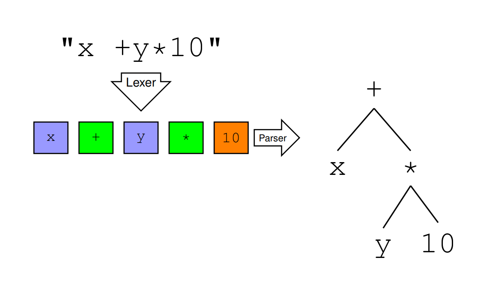

# Lexers

Using tools `fxlex` and `fsyacc`.

Lexers aim to convert input data into tokens that represent the data as objects in program code. This can then be used in a parser to determine what the tokens are used for.



## Syntax

Written in `.fsl`-files.

```fs
rule Token = parse
  | [’ ’ ’\t’ ’\n’ ’\r’]                        { Token lexbuf }
  | [’0’-’9’]+                                  { CSTINT (...) }
  | [’a’-’z’’A’-’Z’][’a’-’z’’A’-’Z’’0’-’9’]*    { keyword (...) }
  | ’+’                                         { PLUS }
  | ’-’                                         { MINUS }
  | ’*’                                         { TIMES }
  | ’(’                                         { LPAR }
  | ’)’                                         { RPAR }
  ...
  | eof                                         { EOF }
  | _                                           { lexerError lexbuf "Bad char" }
```

Left-side is regular expressions that matches the textual input, whereas the right side is the tokens that is used by the program.
