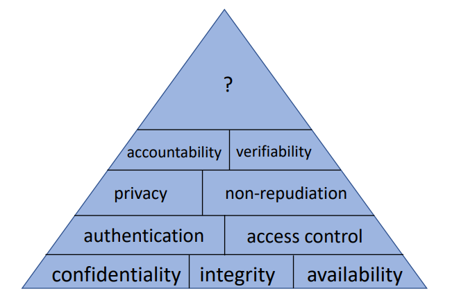

General take-aways:

- As few assumptions as possible
- As many goals as possible
- As many principles as possible

## Adversary

Different types of motives based on motivation:

### Vandals

Goal is to disrupt correct behaviour, not for monetary or similar reasons.

### Activists

Goal is to disrupt for a given cause e.g. Anonymous group.

### Criminals

Goal is to steal or similar for financial or resource gains.

### States

For diplomatic advantages, war advantages etc.

## Security Assumptions

### Technical assumptions

E.g., system is disconnected from the global internet system thus cannot be attacked.

Found an issue with collisions in a hash function (cryptography) allowing the adversary to install software that the computers assumed was from the original developer when it was not.
The software replicated itself onto non-connected systems as well through e.g. external harddrives.

We need to make technical assumptions but reconsider thoroughly if it actually holds.

### Non-technical assumptions

E.g., users will not write their passwords on post-it notes next to their screens.

In particular with strict password policies such as many characters, often changed, symbols and upper- versus lowercase letters.

## Security goals

100% confidentiality, integrity and availability is not possible at once. Thus trade-offs must be made, and security is measured in the resources required of the adversary.

### Confidentiality

Keeping sensitive information secret. (Business secrets, personal data etc.)

Attacks: Eavesdropping, man-in-the-middle

### Integrity

Making sure information is not changed, e.g., changing the amount of money transferred during a transaction or changing the contact information in emails.

Includes not being able to change encrypted data etc., i.e., data that the attacker cannot see before changing it. 

Attacks: Masquerading, message tampering, replaying

### Availability

Data should be accessible.

Attacks: Denial of Service, Distributed Denial of Service

## Security principles

### Simplicity (Economy of Mechanism)

The simpler the easier it is to protect.

### Kerckhoff's principle (Open design)

More scrutiny of a system leaves less defects and thus more secure.

Adversaries will find vulnerabilities even if they are hidden very well - don't hide the vulnerability, but let others find them and fix them/notify you of them.

### Minimum exposure (Reduce external interfaces)

If interfaces are not needed, don't have them.

Reduce the number of doors - don't just lock them when they are not needed.

More exposure means more places to protect, and also a greater window of opportunity for adversaries.

### Least privilege

Any component should not have more privilege than necessary, i.e. the security professors at ITU should not have access to the ITU mail server.

### Fail-safe defaults

The system should start in a secure state, and return to this in the event of a failure.

If authentication server is down, don't allow anyone in until it's up again.

Users should by standard not have any privileges but given them as necessary, not the other way around.

### Complete mediation

Access to systems should be monitored and controlled, not left alone without monitoring.

### No single point of failure

(Relates mostly to availability)

Don't have one component to achieve a goal, but multiple layers (defence in depth).

Use redundant security mechanisms.

### Psychological acceptability

Security mechanisms should be usable, otherwise users will circumvent the mechanisms and leave security holes.

Help the user to make the right choice.

